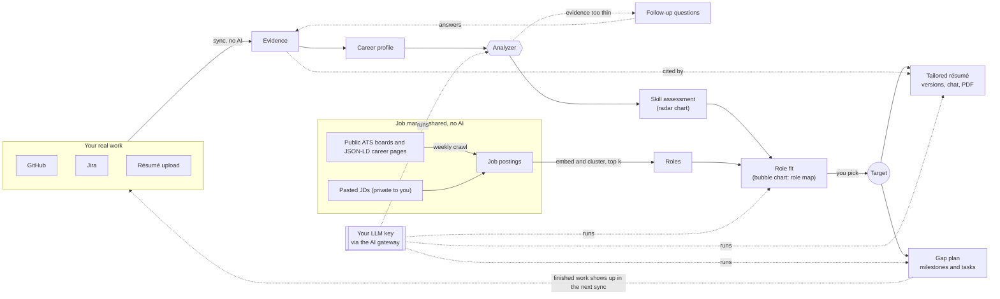
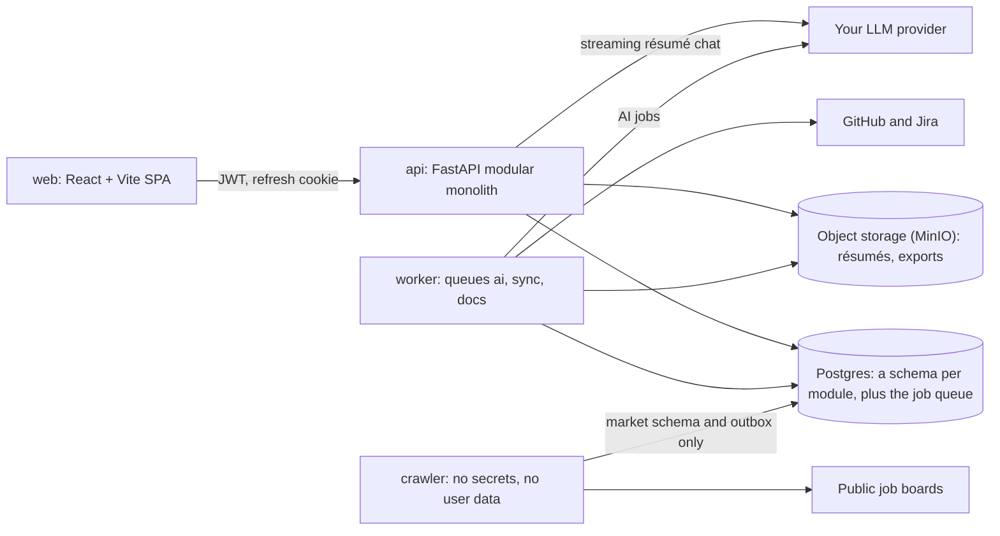

# Job Searching Advisor

Turns the work you have actually done — GitHub, Jira, your résumé — into a
picture of where you stand (a **skill radar**) and what is worth aiming at (a
**role map** of real openings), then plans the route to a chosen role and
writes a résumé for it. Every claim traces back to evidence from your own work.

All AI runs on **your own LLM provider key**. The platform itself only does the
work that needs no model: crawling, parsing, embedding and clustering.

## What it does

| Feature | What you get |
|---|---|
| **Profile & evidence** | Connect GitHub and Jira, upload a résumé. Sources are parsed into evidence, with no AI involved. When the evidence is thin, the analyzer asks follow-up questions and adds your answers as evidence. |
| **Strength report** | A radar chart of 5–10 skill dimensions derived from *your* profile, not a fixed taxonomy. |
| **Role map** | A bubble chart of the roles closest to you in the real market. The x axis is the hiring bar, the y axis is salary and the bubble size is fit. You choose how many roles to analyse (3–20, [ADR 0003](docs/decisions/0003-let-the-user-choose-how-many-roles-to-analyse.md)). |
| **Gap plan** | Pick a **Target** (a matched opening, a watched role or a pasted JD) and get gaps ranked by the fit points each is worth, broken into milestones, tasks and projects. Plans are versioned per Target, and finished work carries forward. |
| **Resume Advisor** | A résumé written for a Target from cited evidence, with requirement coverage, in-place editing saved as versions, a streamed revision chat whose proposals apply only when you accept them, and PDF export. |
| **Accounts** | Email and password sign-in, or optional sign-in with Google. A write-only AI credential, plus a usage budget and ledger. |

Not built yet: suggesting a successor Target when a role splits, interview
reports (the hiring bar is estimated for now), email verification and password
reset, and linking or unlinking Google from Settings. See [`docs/plan.md`](docs/plan.md).

## Concept



The ideas that hold it together:

- **Evidence is the unit of truth.** AI output is untrusted: every evidence id
  it cites must exist in *your* profile, or the whole response is rejected. That
  is the guard against invented claims.
- **Ingestion and crawling are AI-free.** Syncing a source or crawling a job
  board can never spend your key, and hostile HTML never reaches a prompt from
  there.
- **A Target is what you aim at.** A gap plan and a tailored résumé both point
  at a Target, which is a frozen snapshot of that opening's requirements.
- **The loop closes on real work.** Tasks in a plan are meant to produce real
  commits and tickets. The next sync turns them into evidence, and the
  assessment moves.

The full model, with its bounded contexts, domain events and glossary, is in
[`docs/domain_model_review.md`](docs/domain_model_review.md).

## Architecture at a glance



Design choices that are deliberate:

- **The crawler holds no secrets** and has no grant on any user schema. It
  emits events about companies and markets, and the worker fans those out to
  users.
- **Privacy is a storage location, not a flag.** Pasted JDs live in
  `market_user`, which the crawler's database role cannot reach.
- **Row-level security on every owner-zone table**, keyed on a per-transaction
  `app.user_id`. A forgotten `WHERE owner_id` returns nothing, not someone
  else's rows.
- **The AI credential is write-only.** Reading it back returns only the
  provider, the model and the last four characters.
- **Nothing reaches an LLM except through `kernel.ai_gateway`.** The gateway
  estimates cost, checks the budget, decrypts the key for exactly one call,
  validates the output against a schema and writes a ledger row.
- **Glassdoor, Indeed and LinkedIn are not crawled.** Market data comes from
  public ATS boards, schema.org JSON-LD career pages and JDs that users paste.

**Stack:** Python 3.12, FastAPI, Pydantic v2, SQLAlchemy 2 and Alembic on
Postgres. Procrastinate for jobs (no Redis). sentence-transformers and HDBSCAN
for local embedding and clustering. WeasyPrint for PDFs. React and Vite with an
`openapi-typescript` client generated from the API. Details are in
[`docs/technical_boundaries.md`](docs/technical_boundaries.md).

## Getting started

You need **Docker** and **`make`**, and nothing else. Every toolchain, database,
linter and migration runs in a container.

```sh
cp .env.example .env      # fill in every blank
make build-infra          # pull the pinned Postgres and MinIO images
make build-app            # build the prod images, plus the test images the gates use
make start-infra          # start infra, wait until healthy, create least-privilege DB roles
make start-app            # run migrations to completion, then start api, worker, crawler and web
```

Open **http://localhost:21471**. The host ports are this repo's block:

| Port | Service |
|---|---|
| `21470` | api |
| `21471` | web |
| `21472` | Postgres |
| `21473` | MinIO |
| `21474` | MinIO console |

To stop, run `make stop-app` and then `make stop-infra`. `stop-infra` keeps your
data. Only `make clean-up-infra` deletes it.

### Developing with live source

```sh
make build-app MODE=dev   # once, and again after a dependency change
make start-app MODE=dev
```

This bind-mounts `backend/` and `web/src` read-only. When you save a file, the
api, the worker and the SPA (through Vite HMR) reload within a couple of
seconds. The crawler does not reload, because it would hit real job boards on
every save. `MODE` defaults to `prod`, which has nothing mounted and is the only
mode CI and deployed environments use.

## Tests and quality gates

```sh
make test-unit                   # hermetic: runs with --network none
make test-integration            # needs `make start-infra` first
make test-unit PATTERN=rolemap   # narrow either tier
make lint
make typecheck
make scan                        # Python and npm dependencies, plus the prod images (Trivy)
```

Supporting targets, which are never dependencies of the targets above:
`migrate`, `format`, `gen-client` (regenerates the TypeScript API client),
`lock` (regenerates `backend/uv.lock`), `logs` and `clean-up-infra`, which is
the only destructive one.

## Repository layout

```
backend/
  app/        composition root: FastAPI app, worker and crawler entrypoints
  kernel/     technical kernel with no domain logic: db, outbox, jobs, auth, crypto,
              storage, ai_gateway, fetch, embeddings
  domain/     pure domain rules, one package per feature, with no I/O and no framework
  modules/    identity · profile · market · rolemap · assessment · target · gapplan · resume
                public.py  the only importable surface · api.py  routers
                infra/     repositories and adapters · jobs.py  worker handlers
  crawler/    its own deployable, which parses hostile HTML
  migrations/ Alembic
  tests/
web/          React + Vite SPA on the prototype's design system (ADR 0004)
infra/        infra compose project, DB role bootstrap, health wait
prototype/    the original clickable prototype
docs/         intent, domain model, technical boundaries, plan, decisions
```

Sixteen `import-linter` contracts in `backend/.importlinter` enforce the module
boundaries in CI. If one of them breaks, the design is wrong, not the contract.

## Documentation

| Document | What it covers |
|---|---|
| [`docs/intent.md`](docs/intent.md) | What the product is for |
| [`docs/domain_model_review.md`](docs/domain_model_review.md) | The domain model, bounded contexts and the decisions behind them |
| [`docs/technical_boundaries.md`](docs/technical_boundaries.md) | Deployables, module boundaries, data and trust boundaries, and the AI gateway |
| [`docs/plan.md`](docs/plan.md) | Scope for phases 1, 2 and 3 |
| [`docs/decisions/`](docs/decisions/README.md) | Decision records for choices that are costly to reverse |
