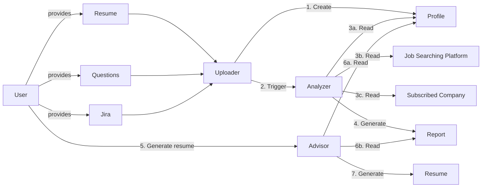
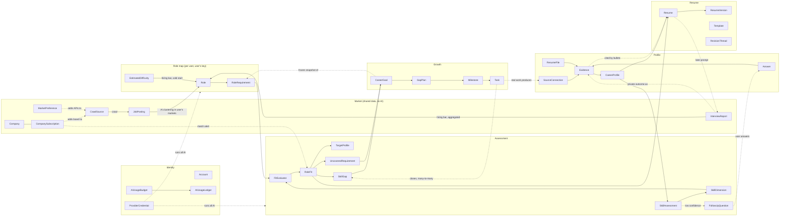
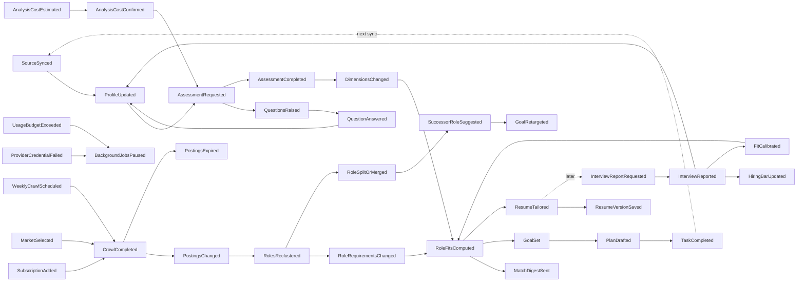

# Domain Model Review: Job Searching Advisor

A review of the proposed domain concepts (`job_searching_advisor_domain_concepts.excalidraw`), checked against the system intent (`intent.md`) and the prototype (`../Career Skills Analysis App/Career Advisor.dc.html`).

## 1. What the proposed model says today

The same canvas has an older sketch with **Analyzer → Report → Recommender → Role Model → Plan Engine** (milestones and tasks, periodic progress review). It also notes: *"Report is the further step analysis based on profile… borrow the ideas from CoT"*. The newer diagram keeps the Profile → Report idea but drops the Recommender and Plan Engine half.

**What works:** Profile and Report are kept separate (facts vs. derived analysis), which is the right call. The pipeline reads left to right, and the Analyzer and Advisor are clearly different responsibilities.

## 2. Findings (ordered by impact)

### 2.1 Goal and gap plan are missing
- `intent.md` covers setting goals, recommending skills to improve and building a gap plan. The prototype has **Gap plan**, **Milestones & tasks**, **Projects** and **Stepping stones**.
- The new diagram ends at Resume, so half the product has no domain concepts.
- **The core loop is missing too.** Real work done on plan tasks → new evidence via connectors → re-assessment → visible progress. This loop is what separates the app from a résumé generator. The older sketch had it ("After some period, system reviews user's task progress").
- **Add:** `CareerGoal` (target Role, optionally a Company) → `GapPlan` → `Milestone` → `Task`. Each Task references the `SkillGap` it closes.
- **Decision: a user can have several active goals** (e.g. a main target plus a stepping-stone role). Consequences:
  - `CareerGoal` has a lifecycle (`active → paused → achieved | abandoned`) and a `priority`, so the UI and plan drafting know which goal leads.
  - Each goal owns one `GapPlan`. Goals often share gaps (both Senior Backend and Staff Platform need reliability), so **Task ↔ SkillGap is many-to-many**. One task can advance several goals, and the planner should merge overlapping tasks instead of duplicating them.
  - Total plan load across active goals needs a check: warn when the combined weekly tasks exceed what one person can realistically do.
  - A Resume's target is independent of goals. It may reference a goal but doesn't need one (the user can tailor for a posting they're not planning toward).

### 2.2 "Uploader" mixes three different things
Resume, Questions and Jira all feed one box, but each has a different nature:

| Input | What it really is | Why it differs |
|---|---|---|
| Jira / GitHub / LinkedIn / personal site | `SourceConnection` | OAuth consent, scopes, revoke, periodic re-sync (prototype `SOURCES` and consent dialog) |
| Uploaded résumé | `ResumeFile` | Plays two roles: an evidence source **and** the base document to revise ("revised rather than replaced") |
| Follow-up questions | `FollowUpQuestion` / `Answer` | The AI generates these **after** analysis when context is thin (`intent.md`). They are not a user upload. |

The diagram shows Questions flowing into the Uploader *before* analysis. That hides the feedback loop: Analyzer → Question → Answer → Profile → re-analyze. The prototype's questions confirm the loop: each carries a *why* tied to a skill dimension and a score effect ("swings Distributed Systems by up to 11 points").

**Recommendation:** rename Uploader to **Ingestion**. Its job is to turn connections and files into **Evidence**. Assessment owns FollowUpQuestion, and answers come back as self-reported Evidence.

### 2.3 Evidence should be first-class
- Every skill score in the prototype has cited evidence (`GitHub · payments-svc — 38 merged PRs on the idempotency + retry layer`).
- `Evidence { source, reference, fact, observedAt, confidence }` is what makes scores explainable.
- It also lets résumé bullets be traced to real work. That is the main guard against the AI inventing claims ("Quantify bullets with data from Jira and GitHub").
- **CareerProfile** = career timeline (positions, tenure) + Evidence set. It holds facts only, never scores.

### 2.4 "Report" is really three concepts with different lifecycles

| Concept | Chart / screen | Depends on | Changes when |
|---|---|---|---|
| `SkillAssessment` | Radar (Strengths) | CareerProfile | Profile changes |
| `RoleFit` / Market map | Bubble chart (Role map) | SkillAssessment + Market | Weekly crawl or assessment changes |
| `SkillGap` | Gap plan, ledger | SkillAssessment + one chosen Role or JobPosting | User picks a different target |

- Make these **immutable snapshots** that reference the Profile version and market snapshot they came from. A saved résumé or plan can then say what it was based on, and stale results can be detected.
- Give each dimension a **confidence/coverage** value (the prototype already shows confidence in the sidebar).
- Use an explicit threshold on that value as the domain rule for when context is "not enough" and follow-up questions should be asked.

### 2.5 The market side is under-modeled
The Analyzer reads "Job Searching Platform" and "Subscribed Company" directly. Several concepts are missing:

- **`JobPosting`**: one opening from a crawled source, a watched company, or a pasted custom JD. It has company, compensation, location and source.
- **`Role`**: a cluster of postings. It has name, **hiring bar**, **salary band per market/location** (prototype filters: Berlin, Remote EU), requirements and opening count.
  - The bubble chart plots **Roles**; the Jobs screen lists **JobPostings**. The model needs both.
- **`Company`** and **`CompanySubscription`**: a watchlist owned by the user. This implies a missing **match alert** flow. The prototype promises alerts "the same day"; with weekly crawling this becomes a **weekly digest** (see below).
- **`MarketPreference`**: the markets the user selects (locations, remote regions). Decision: users pick their own markets; there is no fixed launch list.

**Fit is a relationship, not an attribute.** Hiring bar (X) and salary (Y) belong to the Role. Fit (bubble size) belongs to a *User × Role* pair. The prototype stores `fit` on `ROLES`; don't carry that into the real model.

Put fit in one `FitEvaluator` domain service. "Role map" (User × Role) and "Score this JD with AI" (User × JobPosting) should use the same logic.

#### Market data: crawl sources that allow it
Build the Market context around an in-house crawler, but choose its sources on purpose:

| Source | Use? | Why |
|---|---|---|
| **Company career pages on public ATS job-board APIs** (Greenhouse, Lever, Ashby, Workable, SmartRecruiters) | **Yes, primary** | Public JSON endpoints meant for syndication; structured fields (title, location, description, often pay range); fits `CompanySubscription` directly |
| **Career pages with schema.org `JobPosting` JSON-LD** | **Yes** | Companies publish this markup so search engines index their jobs; parse the structured data |
| **Public job APIs / open data** (e.g. Adzuna API, Germany's Bundesagentur für Arbeit job search, national job boards) | **Yes, for market breadth** | Wide coverage per market and some salary statistics, under published terms |
| **LinkedIn, Indeed, Glassdoor pages** | **No** | Terms of service forbid scraping. LinkedIn has taken scrapers to court (hiQ v. LinkedIn ended with hiQ found in breach of contract and required to delete the data). Glassdoor interview reviews sit behind a login. Strong anti-bot defenses make it fragile as well as legally risky. |

**Model impact:**
- `CrawlSource { kind: atsBoard | jsonLd | publicApi, company?, market?, endpoint, lastFetchedAt, status }`. Each kind is one adapter behind the anti-corruption layer and outputs normalized `JobPosting`s.
- **Crawling is demand-driven.** Crawl what users need: every `CompanySubscription` adds that company's board, and every `MarketPreference` adds the public APIs for that market. Nothing is crawled "just in case".
- **Crawler hygiene** is an infrastructure rule, not domain logic, but required: respect `robots.txt` and rate limits, identify the user agent, and deduplicate the same job appearing from several sources (`JobPosting.canonicalKey` = company + normalized title + location).
- **LinkedIn stays a Profile connector** (the user's own data through OAuth). It is not a market data source.
- **Pasted JDs** let users bring in postings from any site themselves.

#### Decision: crawl weekly
- **One weekly crawl** covers subscribed company boards and market-wide APIs. Role re-clustering and fit recompute follow once per week, which also keeps AI cost on the user's key predictable.
- **Alerts become a weekly `MatchDigest`** listing new postings above the user's fit threshold. Change the prototype copy ("checked nightly", "reaches you the same day") to match.
- **Postings go stale between crawls.** `JobPosting` gets `firstSeenAt`, `lastSeenAt` and `status: open | expired`. A posting missing from a crawl is marked `expired`, not deleted. Expired postings still count toward salary-band history but drop out of the Jobs list and opening counts.
- **Manual refresh:** the user can re-crawl one subscribed company on demand (e.g. right after subscribing), limited per day so the weekly schedule stays the norm.

#### Decision: pasted JDs are private
- `JobPosting.visibility: shared | private`. Crawled postings are `shared`; pasted JDs are `private`, with an `ownerId`.
- **Private postings are used only for their owner.** They appear in the owner's role map, fit scoring and résumé tailoring, and never in anyone else's clustering, Jobs list or salary bands.
- **Dedup doesn't break privacy.** If a pasted JD matches a crawled posting's `canonicalKey`, link the user's private copy to the shared posting so they get weekly updates. Nothing flows back from the private copy to the shared one.

#### Decision: uncrawlable companies fall back to manual
- `CompanySubscription.coverage: crawled | manual`. When adding a subscription, the crawler looks for a supported job board or structured job data. If it finds neither, the subscription is `manual`.
- **Manual subscriptions** show clearly that there are no automatic updates, and offer "paste a JD" for that company. Pasted JDs for it are private (above).
- **Re-check weekly:** each weekly crawl looks again for a supported board for manual subscriptions, since companies change hiring systems. When one is found, coverage switches to `crawled` and the user is told.

This crawler is pure data work with no LLM involved, so it runs on the platform without any AI key.

#### Decision: hiring bar = interview difficulty, and where the data comes from
Glassdoor was the obvious source, but it can't be crawled (see above). Build difficulty from first-party data, with an estimate until enough data exists:
- **`InterviewReport`**: collected from the app's own users, *after* they tailor a résumé for a posting or company. Fields: company, job title, stages reached, difficulty 1–5, outcome, date, and per-stage notes on what was tested and how it went.
  - The app already knows which postings each user targeted, so asking two weeks later ("Did you interview at Meridian Labs? How hard was it?") is a natural moment.
- **Decision: the incentive is more accurate analysis for the reporter.** A report is not only a contribution to others; it feeds the reporter's own model:
  - **Stage outcomes become Evidence.** "Passed the coding round, failed the system-design round" is strong, recent evidence about specific dimensions. It goes into the CareerProfile as `Evidence { source: interviewReport }` and updates the next SkillAssessment.
  - **Real results calibrate fit.** A rejection at a role the app scored as a 90% fit shows the TargetProfile was too generous. The next RoleFit for that role (and similar roles) weighs the report, and the GapPlan can add the tested weak area as a task.
  - The prompt says what the user gets: "Tell us how it went and your fit scores and plan get sharper." Nothing is locked behind reporting.
- **Two parts, two visibilities.**
  - *Shared* (anonymized, aggregated): company, job title, stages count, difficulty, date. This feeds the hiring bar.
  - *Private* (owner only): outcome, per-stage notes. This feeds the reporter's Evidence and fit calibration.
- **Minimum group size:** show reported difficulty for a company + title only when at least 3 distinct users reported it. Below that, use the estimate, so a single report can't be traced to one person.
- **`EstimatedDifficulty`** covers the cold start: an AI estimate from the posting itself (seniority, requirement depth, stated interview stages, company size), run on the user's key. It is always labeled as an estimate.
- **`Role.hiringBar`** = a blend that shifts weight from the estimate to real reports as `sampleSize` grows. Store `sampleSize`, `confidence` and `basis: estimated | reported | blended`, and draw estimated bubbles differently (e.g. dashed outline).
- **Why this axis works:** the hiring bar doesn't depend on the user, while fit does. The chart separates "hard to get in" from "you'd be good at it".

#### Decision: Roles are grouped by AI, per user, on the user's key
The user pays for AI work. Shared clustering would need a platform key, so **Role clustering becomes per-user**:
- **Shared data vs. per-user AI results:**
  - Shared, platform-owned: `CrawlSource`, `JobPosting`, `Company`, aggregated `InterviewReport`s. These are plain data with no AI.
  - Per user, on the user's key: `Role`, `RoleRequirement`, `EstimatedDifficulty`, `RoleFit`. Each is computed only over postings in *that user's* markets and subscriptions.
- **Role moves out of the shared Market context** into a per-user **Role map**. That fits per-user dimensions (2.6) and removes the platform AI key, so there is only one AI credential to secure.
- **Requirements are free text, not scores.** `RoleRequirement` (statement, weight, expected level) is extracted from member postings.
- **Cost control:** the user's key only processes postings that are new or changed since the last run, in their markets. The monthly budget (2.8) caps it, and the first run shows a cost estimate before starting.
- **Known trade-off:** two users can get different role names for the same postings. That's acceptable, since nothing compares users.
- **Role identity must survive re-clustering.** Roles have stable ids and emit `RoleRenamed`, `RoleSplit` and `RoleMerged` events with lineage.
  - A `CareerGoal` stores a **frozen snapshot** of its role's requirements.
  - Decision: when a role splits or drifts, **the app suggests** the successor role with the most requirement overlap with the snapshot. The goal keeps tracking its snapshot until the user accepts the suggestion or picks another role. It is never moved silently.
- **Custom JDs** are private to their owner. They are placed on the nearest role in the owner's bubble chart, but keep their own requirements for scoring and tailoring.
- **Salary bands are per selected market.** "Senior Backend Engineer" is one role with a Berlin band and a Remote EU band when the user selected both.
  - When a market has too few postings for a role, show the band as low-confidence rather than hiding the role.

### 2.6 Skill dimensions are per user, so fit needs a projection step
- `intent.md` says the radar dimensions are *"decided by profile analysis"*, so they vary per user.
- Gap and fit, however, compare the user's scores with a Role's target, and that needs **the same dimension space** on both sides. The prototype hides this by keying `SKILLS[].id` and `ROLES[].profile` by the same ids.

#### Decision: dimensions are different per user
Handle this by making the comparison explicit:
- **`SkillDimension` belongs to one user's assessment.** It has an id, name, description and the Evidence it is built from. There is no global taxonomy.
- **Roles store requirements, not dimension scores** (see 2.5).
- **`FitEvaluator` projects requirements onto the user's dimensions.** For each User × Role (or User × JobPosting), it maps every RoleRequirement to the user's dimensions and produces a `TargetProfile` (target score per dimension). Fit and gaps are computed from that.
  - The projection is an AI judgment, so store it inside the `RoleFit` snapshot with its reasoning. The user can then see why "Staff Platform" expects 88 on *their* "Technical Leadership".
- **Unmapped requirements are the most important gaps.** A requirement that matches none of the user's dimensions means the profile has *no* evidence for it at all, which is different from a low score.
  - Show these as `UncoveredRequirement` gaps. Never drop them silently; otherwise a user with narrow evidence would look like a strong fit.
- **Dimensions must stay stable over time.** The core loop in 2.1 shows progress by comparing assessments, which only works if "Reliability" means the same thing in March and in June.
  - Rule: re-assessment reuses existing dimension ids. It may add dimensions. Merges and renames are recorded as lineage (`DimensionMerged`, `DimensionRenamed`) so radar history and plan progress still line up.
- **Known limits:**
  - Users can't be compared with each other; nothing in the intent needs that.
  - Benchmarks such as the prototype's "senior-bar benchmark of ~60%" must come from role requirements, not from other users' scores.
- **Dimension count is bounded: 5–10 per user.** Fewer hides gaps; more makes the radar unreadable and the mapping noisy. Above 10, the analysis must merge related dimensions (recorded as `DimensionMerged`). Below 5, it raises follow-up questions instead of inventing thin dimensions.
- **Cost:** projection runs per user × role, on the user's model. Recompute only when the user's dimensions change or a Role's requirements change materially. A new posting joining a cluster usually isn't a material change.

### 2.7 The Resume aggregate is too thin
The Advisor's inputs are only Profile and Report. Generating or revising a résumé also needs:
- a **target**: a Role from the bubble chart, a JobPosting, or a typed-in role, optionally with a company
- a **Template**
- the **base ResumeFile**, when one was uploaded

The Resume model should include:
- **Structured content:** sections and bullets, where each bullet can cite Evidence.
- **Versions:** `ResumeVersion` history (prototype: "Save this version", reopen a saved résumé).
- **Edit sources:** manual edits and AI chat edits (`RevisionThread`) both produce versions.
- **Export is presentation:** the template, white background and PDF output are rendering concerns, not domain rules.

"Advisor" is vague; it could mean the whole app. Consider **ResumeTailor**, and give plan generation to the Growth context.

### 2.8 Cross-cutting concerns to keep out of the core
- **`Account` vs `SourceConnection`**: login OAuth (Google) and connector OAuth (GitHub, Jira, LinkedIn) use different tokens, scopes and revoke rules. Keep them as separate models even though both say "OAuth".
- **`AIProviderConfig`** (provider, model, API key, base URL) is a domain constraint, not only a setting.
  - The prototype stores the key "in this browser".
  - Weekly subscription matching, scheduled market refresh with fit recompute, and periodic plan review all need **server-side** access to the model.
  - Where the key lives decides which flows can run in the background.

#### Decision: the key is stored encrypted on the server
This enables the background flows. It also brings rules the model has to include:
- **`ProviderCredential` is write-only.** The client can set, test, replace or delete it, but never read it back (show only the last 4 characters). Encrypt it at rest with a separate key (envelope encryption via a KMS), and decrypt it only inside the worker making the AI call.
- **Background jobs spend the user's money.** Add an `AIUsageBudget` (a monthly cap set by the user) and an `AIUsageLedger` (per call: job type, model, tokens, cost). Jobs that would exceed the cap pause and notify instead of running.
- **Keys fail.** If a key is revoked, expires or hits a rate limit, emit `ProviderCredentialFailed`, pause scheduled jobs for that user, and show it clearly. Don't leave reports quietly out of date.
- **Record the model on every AI-derived snapshot** (SkillAssessment, RoleFit, GapPlan, ResumeVersion). A user who switches models can then see why results changed.
- **All AI work runs on the user's key** (decision: the user pays). That includes role clustering, requirement extraction and difficulty estimates (see 2.5). The platform runs only non-AI work (crawling, parsing, aggregating interview reports), so it needs no AI credential of its own.
- **Show cost before spending.** The first analysis and the first role map estimate their token cost against the budget and ask the user to confirm. Later incremental runs happen automatically within the budget.

### 2.9 Smaller diagram issues
- **"2. Trigger"** makes every upload start a full analysis. The prototype has an explicit "Analyze with AI" step. Prefer a `ProfileUpdated` event plus an explicit or debounced analysis request.
- **Step 5** doesn't show that a Report (and a target) must exist first.
- **Unlabeled boxes:** several rectangles (Advisor, Resume, User targets) have their text floating outside the container, so the arrows attach to unlabeled boxes.
- **Missing sources:** only Jira feeds the Uploader; GitHub, LinkedIn and the personal site are missing.
- **Stray content:** the excalidraw file also has unrelated scenes (legacy-code refactoring, OS notes, a ticketing model). Consider moving them out so the domain file stays focused.

## 3. Proposed bounded contexts

**Cardinality at a glance**
- Account 1 — 1 CareerProfile, 1 — 1 ProviderCredential, 1 — * SkillAssessment (history)
- SkillAssessment 1 — 5..10 SkillDimension (per user; ids stable across assessments)
- Account 1 — * MarketPreference, 1 — * CompanySubscription
- CrawlSource 1 — * JobPosting; JobPosting is shared by all users
- Account 1 — * Role (per user); Role * — * JobPosting, Role 1 — * RoleRequirement
- Account × Role → 0..1 current RoleFit (plus history)
- Account 1 — * CareerGoal (several active at once), CareerGoal 1 — 1 GapPlan
- Task * — * SkillGap
- Account 1 — * Resume, Resume 1 — * ResumeVersion, Account 1 — * InterviewReport

### Key domain events

## 4. Glossary

| Term | Definition | Context |
|---|---|---|
| Account | A person using the app; signs in with Google OAuth or email | Identity |
| ProviderCredential | The user's AI provider, model, base URL and API key; stored encrypted on the server, never readable by the client; the only AI credential in the system | Identity |
| AIUsageBudget / AIUsageLedger | User-set monthly spending cap for AI on their key, and the per-call record checked against it | Identity |
| SourceConnection | An authorized link to GitHub, Jira, LinkedIn, or a personal-site URL; has scopes and sync state | Profile |
| ResumeFile | An uploaded résumé (PDF/DOCX); parsed into Evidence and usable as a revision base | Profile |
| Evidence | One cited fact about the user's work (source, reference, fact, date, confidence) | Profile |
| Answer | A user's reply to a FollowUpQuestion, stored as self-reported Evidence | Profile |
| CareerProfile | Career timeline plus all Evidence for one user; facts only, one per user | Profile |
| CrawlSource | A crawlable source that permits it: a public ATS job board, a career page with JSON-LD, or a public job API | Market |
| JobPosting | One normalized opening, deduplicated by company + title + location. Crawled postings are shared; pasted JDs are private to their owner. Tracks first/last seen and open/expired. | Market |
| Company | An employer seen in the market | Market |
| CompanySubscription | A user's watch on a Company. `crawled` coverage adds its job board to the weekly crawl and the digest; `manual` coverage relies on pasted JDs | Market |
| MarketPreference | A location or remote region the user selects; adds that market's public job APIs to crawling | Market |
| InterviewReport | A user's report of an interview. The shared part (company, title, stages, difficulty) is aggregated for the hiring bar when ≥3 users reported; the private part (outcome, stage notes) becomes the reporter's Evidence and calibrates their fit | Market |
| MatchDigest | Weekly message listing new open postings above the user's fit threshold, for subscribed companies and selected markets | Market |
| Role | An AI-grouped cluster of postings in *one user's* markets, with a stable id and lineage, hiring bar, salary bands per market and opening count | Role map |
| RoleRequirement | A skill requirement pulled from a Role's postings (statement, weight, expected level); has no dimension | Role map |
| EstimatedDifficulty | AI estimate of interview difficulty from posting content, used until enough InterviewReports exist | Role map |
| Hiring bar | A Role's interview difficulty (bubble chart X axis); blends estimate and reports, with sample size, confidence and basis | Role map |
| SkillDimension | One axis of *this user's* skills (5–10 per user), defined by their profile analysis; its id stays stable across re-assessments | Assessment |
| SkillAssessment | Snapshot of per-dimension scores and confidence for a Profile version (radar); records the model used | Assessment |
| FollowUpQuestion | A question the AI generates when a dimension's confidence is below threshold | Assessment |
| FitEvaluator | Domain service that maps RoleRequirements onto a user's dimensions and scores fit | Assessment |
| TargetProfile | Target score per user dimension for one Role or JobPosting, produced by that mapping | Assessment |
| RoleFit | Snapshot of fit between a user and a Role or JobPosting (bubble size), with TargetProfile and reasoning | Assessment |
| SkillGap | User's score minus the target score on one dimension | Assessment |
| UncoveredRequirement | A RoleRequirement that matches none of the user's dimensions, meaning there is no evidence at all | Assessment |
| CareerGoal | A target Role (optional company) the user commits to; many per user, with status and priority; holds a frozen snapshot of the Role's requirements; retargeted only when the user accepts a suggested successor | Growth |
| GapPlan | Plan to close one goal's gaps, with Milestones, Tasks and suggested projects | Growth |
| Milestone / Task | A time-boxed outcome and the concrete actions under it; a Task can close gaps for several goals | Growth |
| Resume | A structured, editable résumé aimed at one target | Resume |
| ResumeVersion | A saved state of a Resume that can be reopened; records the model used | Resume |
| Template | Visual layout used when exporting (white background by default) | Resume |
| RevisionThread | The AI chat that proposes and applies edits to a Resume | Resume |

## 5. Traceability

### 5.1 `intent.md` → concepts

| Intent requirement | Concepts |
|---|---|
| Import from Jira, GitHub, LinkedIn (OAuth), personal website | SourceConnection → Evidence |
| Upload an existing résumé / select existing résumés | ResumeFile, Resume, ResumeVersion |
| Select a template to export | Template |
| Follow-up questions when context is insufficient | SkillAssessment confidence → FollowUpQuestion → Answer |
| Analyze experience and career trajectory | CareerProfile (timeline + Evidence) |
| Skill strength radar; dimensions decided by profile analysis | SkillAssessment over the user's own 5–10 SkillDimensions |
| Bubble chart: X = hiring bar, Y = salary, size = fit, one bubble per role | Role (hiring bar from EstimatedDifficulty + InterviewReport, salary band) + RoleFit |
| Glassdoor / LinkedIn / Indeed | **Changed:** these can't be crawled. Replaced by CrawlSource (ATS boards, JSON-LD, public job APIs) and pasted JDs. LinkedIn stays a Profile connector. |
| User subscribes to company jobs | CompanySubscription (crawled or manual) → CrawlSource (company board) → weekly MatchDigest |
| Customize JD | JobPosting (private, owner only), placed on nearest Role, RoleFit against the posting |
| Generate résumé from a bubble-chart role or a typed role | Resume target = Role, JobPosting, or free-text role |
| Manual edit; chat with AI to modify | ResumeVersion, RevisionThread |
| Save / reopen résumés | ResumeVersion |
| Recommend goals / skills when the gap is too large | SkillGap + UncoveredRequirement → CareerGoal → GapPlan |
| Google OAuth login or self-created account | Account |
| User configures model provider and API key | ProviderCredential, AIUsageBudget |
| AI for analysis, questions, résumé revision, gap plan | SkillAssessment, FollowUpQuestion, Role clustering, FitEvaluator, RevisionThread, GapPlan — all on the user's ProviderCredential |

### 5.2 Prototype data → concepts

| Prototype structure | Concepts | Note |
|---|---|---|
| `SKILLS[]` (score, read, evidence) | SkillDimension + SkillAssessment + Evidence | Split per-user dimensions, score snapshot, and cited facts |
| `ROLES[]` (bar, salary, band, openings) | Role (per user) | `bar` is interview difficulty (estimated, reported or blended) |
| `ROLES[].profile` | RoleRequirement → TargetProfile | Roles hold requirements; per-dimension targets are computed per user |
| `ROLES[].fit`, `.read` | RoleFit | Per user, not a Role attribute |
| `SOURCES[]`, `state.sources`, consent | SourceConnection | |
| `QUESTIONS[]`, `state.answers`, effects | FollowUpQuestion, Answer | |
| `state.resumeUploaded` | ResumeFile | |
| `MILESTONES[]`, `state.done`, `PROJECTS[]` | GapPlan, Milestone, Task | Projects are suggested Tasks with no due date |
| `state.roleId` on the plan screen | CareerGoal | The prototype has one target; the model allows several active goals |
| stepping stones | RoleFit (higher-fit Roles near the goal) | Derived; a natural second CareerGoal |
| `JOBS[]`, `state.jobFilter` | JobPosting | Filter by `CrawlSource.kind` / company instead of LinkedIn / Glassdoor / Indeed |
| `marketFilters` (Berlin, Remote EU) | MarketPreference | User-selected, not a fixed list |
| `state.subs`, `subsNote` | CompanySubscription, MatchDigest | Copy changes from "checked nightly… same day" to a weekly digest; show crawled vs. manual coverage |
| `state.jd`, `jdFit`, `jdPoints` | JobPosting (private) + RoleFit + SkillGap | |
| `TEMPLATES[]`, `state.tpl` | Template | |
| `state.saved`, `state.edits`, `state.opts` | Resume, ResumeVersion | Options are generation parameters for the tailor |
| `state.chat` | RevisionThread | |
| `PROVIDERS`, provider/model/apiKey/baseUrl | ProviderCredential | The prototype says "saved in this browser"; the decision is server-side and encrypted |
| `confidence` | SkillAssessment confidence | Should be per dimension, not one global number |
| `loggedIn`, `email`, `authMode` | Account | |

## 6. Decisions and remaining questions

### 6.1 Decisions

| # | Date | Question | Decision | Where it changed the model |
|---|---|---|---|---|
| 1 | 2026-09-14 | Skill taxonomy | **Different per user** | 2.6: FitEvaluator mapping, TargetProfile, UncoveredRequirement, stable dimension ids |
| 2 | 2026-09-14 | Role catalog | **Grouped by AI from postings** | 2.5: RoleRequirement, stable Role ids with lineage, frozen snapshot on CareerGoal |
| 3 | 2026-09-14 | API key location | **Stored encrypted on the server** | 2.8: write-only ProviderCredential, usage budget and ledger, failure handling |
| 4 | 2026-09-14 | Multiple goals | **Yes** | 2.1: goal status and priority, Task ↔ SkillGap many-to-many, plan-load check |
| 5 | 2026-09-14 | Hiring bar source | **Interview difficulty** | 2.5: InterviewReport + EstimatedDifficulty blend, sample size and confidence |
| 6 | 2026-09-14 | Market data source | **In-house crawler**, limited to sources that permit it (ATS job boards, JSON-LD career pages, public job APIs); no scraping of LinkedIn, Indeed or Glassdoor | 2.5: CrawlSource, demand-driven crawling, dedup key |
| 7 | 2026-09-14 | Who pays for shared AI work | **The user** | 2.5 / 2.8: Role clustering moves per user onto the user's key; no platform AI credential; cost estimate before first run |
| 8 | 2026-09-14 | Dimension count | **Bounded, 5–10** | 2.6: merge above 10, ask follow-up questions below 5 |
| 9 | 2026-09-14 | Launch markets | **User selects** | 2.5: MarketPreference drives crawling and salary bands |
| 10 | 2026-09-14 | Goal when its role splits | **App suggests a successor** | 2.5: successor by requirement overlap; goal keeps its snapshot until the user accepts |

| 11 | 2026-09-14 | Interview-report incentive | **More accurate analysis for the reporter** | 2.5: private outcome becomes Evidence and calibrates RoleFit; shared part aggregated with a minimum of 3 reporters |
| 12 | 2026-09-14 | Pasted JDs | **Private to their owner** | 2.5: `JobPosting.visibility`, one-way link to matching shared posting |
| 13 | 2026-09-14 | Uncrawlable companies | **Manual fallback (paste JDs)** | 2.5: `CompanySubscription.coverage`, weekly re-check for a supported board |
| 14 | 2026-09-14 | Crawl frequency | **Weekly** | 2.5: MatchDigest replaces same-day alerts, posting expiry, rate-limited manual refresh |

### 6.2 Remaining questions

None of the earlier questions are still open. These defaults were chosen during the update; change them if they don't fit:
- **Minimum group size for shared difficulty:** 3 distinct reporters.
- **Manual refresh limit:** a small per-day cap for re-crawling one subscribed company.
- **Expired postings:** kept for salary-band history, hidden from the Jobs list.
- **Digest threshold:** the prototype's 70% fit, adjustable per user.

**Suggested next step:** redraw `job_searching_advisor_domain_concepts.excalidraw` from section 3, and update the prototype's Jobs and subscription copy to the weekly digest.

**Technical boundaries:** deployable units, data and trust boundaries are in [`technical_boundaries.md`](technical_boundaries.md).
