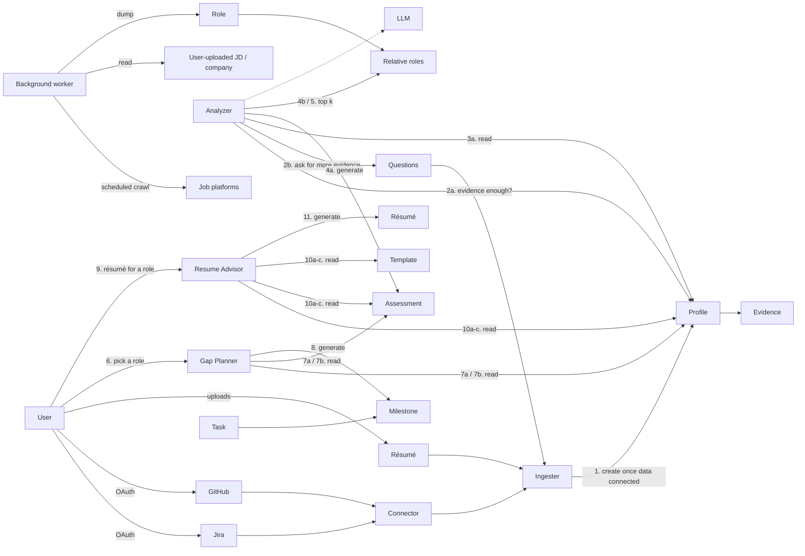
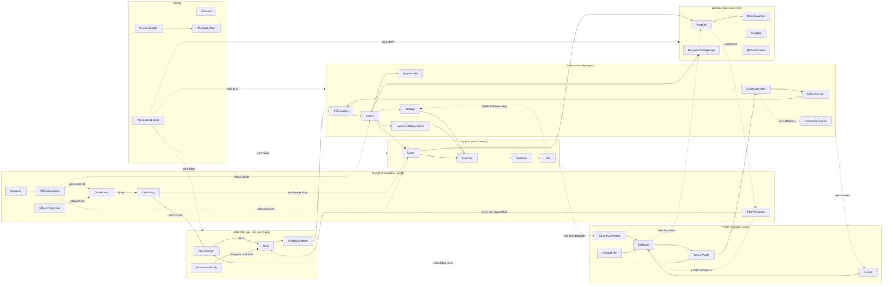
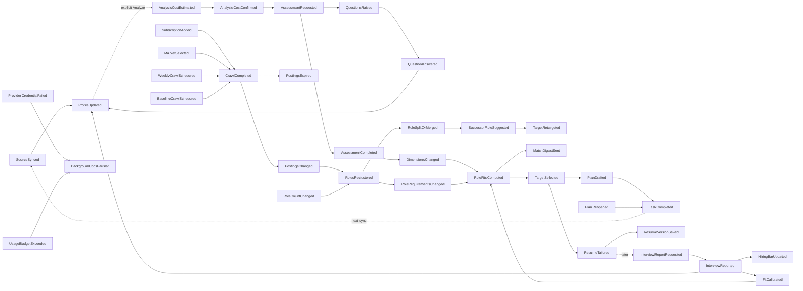

# Domain Model Review: Job Searching Advisor

A review of the domain concepts in `job_searching_advisor_domain_concepts_v2.excalidraw`, checked against the system intent (`intent.md`) and the prototype (`../prototype/Career Advisor.dc.html`).

The first review covered `job_searching_advisor_domain_concepts.excalidraw` (v1). Its 14 decisions still stand unless section 6 says one was superseded. v2 took up most of its findings, so this version reviews v2 and keeps the settled material the model still depends on.

## 1. What the v2 model says

**What v2 fixed from the first review:**
- *Uploader mixed three things* → the **Ingester** turns connectors and files into **Evidence**, and **Questions come from the Analyzer** (2b) after it checks whether the evidence is enough (2a). The feedback loop is now visible.
- *Goal and gap plan missing* → **Gap Planner → Milestone → Task** are back.
- *Evidence should be first-class* → the Profile holds **Evidence**.
- *Report is three things* → the Analyzer produces an **Assessment** (radar) and a separate list of **relative roles** (role map). Gaps belong to the Gap Planner.
- *"Advisor" was vague* → it is now **Resume Advisor**, one of three consumers next to the Gap Planner. The model uses this name. The earlier "ResumeTailor" suggestion is dropped.
- The flow reads left to right, and every step is numbered.

## 2. Findings (ordered by impact)

### 2.1 Plans aim at a Target, not a goal
The prototype no longer has a goal. Its gap plan screen says "Plan a route to" and offers three kinds of target: one of the top matched roles (a role **at a company**), a role the user subscribed to, or a pasted JD ("My own JD"). Past plans are listed under **Plan history**, one per role and company, and can be reopened "to pick the milestones back up where you left them". The intent says the same: *"The gap plan is generated by the given role selected by user. The history of the gap plan list can be revisited again."*

**Decision 16: a GapPlan belongs to a Target, and there is no CareerGoal.** This supersedes decision 4 (several active goals).
- **`Target`** is what a plan or a résumé is aimed at. It has three kinds:
  - `matchedPosting`: a shared `JobPosting` inside one of the user's top-k Roles (the prototype's `TARGETS`)
  - `subscription`: a `RoleSubscription` (2.4)
  - `privatePosting`: a JD the user pasted, private to them (decision 12)
- A Target carries a **frozen snapshot of its requirements** when it is chosen. Postings expire and Roles re-cluster, but the plan still says what it was planned against.
- **`GapPlan`** belongs to one Target. It holds the `SkillGap`s and `UncoveredRequirement`s it addresses, Milestones and Tasks, and the model and template version that drafted it.
  - **Regenerating** makes a new GapPlan version for the same Target. Task completion carries over to the new version by matching tasks.
  - **Plan history** is the list of GapPlans across Targets, newest first. Reopening one resumes it; nothing is lost when the user plans for a different Target.
  - **Task ↔ SkillGap stays many-to-many**. Across plans, a completed task counts wherever it closes the same gap.
- **Removed with CareerGoal:** goal status and priority, and the check on combined plan load across goals. With no "active goal", one plan is simply the one the user is looking at.
- **The core loop is unchanged, and it is still the point of the product.** Tasks produce real work → the next connector sync brings new Evidence → re-assessment → the plan shows progress.
- **Role drift** (decision 10 amended by decision 20): when a Role splits or merges, a plan whose Target came from that Role keeps its snapshot. The app suggests the successor Role with the most requirement overlap, and the user decides.

### 2.2 The role map shows the top k roles, and the user picks k
v2 step 5, "Get top k relative roles", and the intent (*"Select the top k similar role… User can decide the number of k"*) match what was built. ADR 0002 already limits the analysis to the ten roles closest to the profile.

- **`RoleSelection`** picks the k Roles whose posting centroid is closest to the profile's embedding. The ranking runs locally with no AI, so it costs the user nothing (ADR 0002). It happens before any Role has requirements, so it cannot use RoleFit.
- **Decision 17: the user picks k within a bound**, recorded in [ADR 0003](decisions/0003-let-the-user-choose-how-many-roles-to-analyse.md) (proposed 3–20, default 10). Each analysed Role costs calls on the user's key, so raising k shows a new cost estimate before the run (2.7).
- **Two lists from one selection:**
  - The **bubble chart** plots the k **Roles** (hiring bar, salary band, fit).
  - The **Top matched list** ranks **postings** inside those Roles: RoleFit plus a per-posting adjustment from the posting's own requirements (the prototype's `fitAdj` and `why`). Subscribed roles are listed next to it. Each row can be subscribed to, planned for, or written for.
- Lowering k retires Roles through the usual reconciliation. A plan or résumé whose Target came from a retired Role keeps its snapshot.

### 2.3 The background worker must not produce shared Roles
v2 has one Background worker that crawls job platforms, reads user-uploaded JDs and companies, and **dumps Roles**. The Analyzer then reads those Roles. Two decisions conflict with that:

- **Roles are per user** (decisions 2 and 7). Postings are shared, but grouping them into Roles, naming them and extracting requirements happens per user, on that user's key and only over their markets. The worker's shared output is **`JobPosting`**. Each user's **role-map job** builds their Roles from those postings.
- **Pasted JDs are private** (decision 12). A user's JD must never feed a shared crawl or someone else's Roles. It stays in the owner's private store, gets placed on the nearest of *their* Roles, and keeps its own requirements.

Redraw the worker as two things: the **crawler** (shared, no AI, no user data) → JobPosting, and the per-user **role-map job** → Role.

### 2.4 Subscriptions are to a role at a company, with a URL
The prototype's watchlist now takes a **role, a company and a "Careers or JD URL"**. The entry appears in the gap plan and résumé targets ("Subscribed to Senior Backend at Kestrel Financial — it now appears in your gap plan and résumé targets"). A company-only subscription was the earlier model.

**Decision 19:** `CompanySubscription` becomes **`RoleSubscription { company, roleTitle, roleId?, url?, coverage: crawled | manual }`**.
- `roleTitle` is the Role's name when the user subscribed. `roleId` points at the user's Role while it exists; Roles are per user and can retire, so the title is what persists.
- **The URL seeds board discovery.** A careers page or JD link tells the crawler where to look for a supported ATS board or JSON-LD. With no URL and no board found, coverage is `manual`: nothing updates automatically, and "paste a JD" is offered (decision 13).
- A subscription is a Target (2.1) whether or not a matching posting is open. With no open posting, its requirements come from the Role's requirements, labelled as such (the prototype: "…at this role's bar of 81/100").
- The weekly `MatchDigest` covers subscribed roles as well as markets.

### 2.5 Market data: permitted sources, crawled on demand and from a baseline
The intent's Background worker still lists Glassdoor, LinkedIn and Indeed, and adds *"Fetched system wide"*. **Decision 6 stands:** those three are not crawled. Their terms forbid it, LinkedIn has litigated it, and their anti-bot defenses make it fragile. LinkedIn stays a Profile connector for the user's own data.

| Source | Use? | Why |
|---|---|---|
| **Company career pages on public ATS job-board APIs** (Greenhouse, Lever, Ashby, Workable, SmartRecruiters) | **Yes, primary** | Public JSON endpoints meant for syndication; structured fields (title, location, description, often pay range); fits `RoleSubscription` directly |
| **Career pages with schema.org `JobPosting` JSON-LD** | **Yes** | Companies publish this markup so search engines index their jobs |
| **Public job APIs / open data** (e.g. Adzuna, Germany's Bundesagentur für Arbeit job search, national job boards) | **Yes, for market breadth** | Wide coverage per market and some salary statistics, under published terms |
| **LinkedIn, Indeed, Glassdoor pages** | **No** | Terms of service forbid scraping. LinkedIn has taken scrapers to court (hiQ v. LinkedIn ended with hiQ found in breach of contract). Glassdoor interview reviews sit behind a login. |

**Decision 15: "system wide" means a baseline crawl alongside demand-driven crawling.**
- **Demand-driven** (as before): every crawled `RoleSubscription` adds its company's board, and every `MarketPreference` adds that market's public APIs.
- **Baseline:** a platform-curated list of permitted sources (ATS boards of well-known employers, public job APIs for common markets) is crawled every week whatever users ask for. A new user's first role map then has postings to cluster before they subscribe to anything.
- Both feed the same shared `JobPosting` pool. `CrawlSource.origin: baseline | demand` records why a source is crawled. It never says who asked.
- The baseline is plain data work with no AI, so it is paid by the platform (decision 7's rule: generative AI on the user's key, plain computation on the platform).
- This replaces the earlier rule that "nothing is crawled just in case". What it costs: platform crawl volume grows with the baseline list, not only with users, and someone has to curate that list.

**Unchanged model rules:**
- `CrawlSource { kind: atsBoard | jsonLd | publicApi, origin: baseline | demand, company?, market?, endpoint, lastFetchedAt, status }`. Each kind is one adapter behind the anti-corruption layer and outputs normalized `JobPosting`s.
- **Crawler hygiene:** respect `robots.txt` and rate limits, identify the user agent, and deduplicate the same job across sources (`JobPosting.canonicalKey` = company + normalized title + location).
- **Weekly crawl** (decision 14): one weekly run; `JobPosting` has `firstSeenAt`, `lastSeenAt` and `status: open | expired`. A posting missing from a crawl is marked expired, not deleted, and still counts toward salary history. Alerts are a weekly `MatchDigest`. A user can re-crawl one subscribed company on demand, rate-limited per day.
- **Pasted JDs are private** (decision 12): `visibility: shared | private`. If one matches a crawled posting's `canonicalKey`, the private copy links to the shared one so it gets updates. Nothing flows back.
- **Uncrawlable companies fall back to manual** (decision 13), and each weekly crawl re-checks them for a supported board.

**Fit is a relationship, not an attribute.** Hiring bar (X) and salary (Y) belong to the Role; fit (bubble size) belongs to a *User × Role* pair. All fit, whether for a Role, a posting or a pasted JD, comes from one `FitEvaluator`.

#### Hiring bar = interview difficulty (decisions 5 and 11)
Glassdoor can't be crawled, so difficulty is built from first-party data, with an estimate until there is enough:
- **`InterviewReport`** comes from the app's own users, asked about two weeks after they tailor a résumé for a posting. Fields: company, job title, stages reached, difficulty 1–5, outcome, date, per-stage notes.
- **The incentive is sharper analysis for the reporter.** Stage outcomes become the reporter's Evidence, and real results calibrate their RoleFit ("rejected at a 90% fit" means the TargetProfile was too generous).
- **Two parts, two visibilities.** Shared and anonymized: company, title, stages, difficulty, aggregated only when **at least 3 distinct users** reported. Private: outcome and stage notes.
- **`EstimatedDifficulty`** covers the cold start. It is an AI estimate from the posting, run on the user's key and always labelled as an estimate.
- **`Role.hiringBar`** blends the estimate and reports as `sampleSize` grows, with `confidence` and `basis: estimated | reported | blended`. Estimated bubbles are drawn differently. Phase 1 ships `estimated` only.

#### Roles are grouped by AI, per user, on the user's key (decisions 2 and 7)
- **Shared, platform-owned, no AI:** `CrawlSource`, `JobPosting`, `Company`, aggregated `InterviewReport`s.
- **Per user, on the user's key:** `Role`, `RoleRequirement`, `EstimatedDifficulty`, `RoleFit`, computed only over postings in *that user's* scope.
- Requirements are free text (`RoleRequirement`: statement, weight, expected level), not scores.
- Only new or changed postings are processed; the monthly budget caps the spend; the first run shows a cost estimate.
- Two users can get different names for the same postings. That's acceptable, since nothing compares users.
- **Role identity survives re-clustering:** stable ids, with `RoleRenamed`, `RoleSplit` and `RoleMerged` events and lineage.
- **Salary bands are per selected market.** A market with too few postings shows a low-confidence band rather than hiding the role.

### 2.6 Ingestion stays AI-free
The first v2 draft had the Ingester calling the LLM. **Decision 18: ingestion never calls a model.**
- Connectors and the résumé parser turn source data into Evidence with deterministic rules: counts, links, dates, parsed sections. Judging what the evidence *means* starts with the Analyzer. The Gap Planner and Resume Advisor use AI too, but only on Evidence and Assessments that already exist.
- **Why:** a sync runs whenever a connector refreshes. With AI in ingestion, every sync would spend the user's key without a cost estimate or a confirmation. Ingestion also handles the most hostile input (repositories, tickets, uploaded files). Keeping it away from the model keeps prompt injection to the one place that already treats input as data.
- **What it costs:** Evidence facts are plainer ("38 merged PRs on payments-svc") than an LLM summary would be. The Analyzer does the interpreting, and cites the Evidence ids behind each score.
- The diagram now reflects this: the Ingester → LLM arrow is gone. It still needs LLM arrows from the Gap Planner and Resume Advisor (2.11).

### 2.7 Evidence, snapshots and follow-up questions
- **Evidence** `{ source, reference, fact, observedAt, confidence }` makes every score explainable and lets résumé bullets be traced to real work. **CareerProfile** = career timeline + Evidence set, facts only.
- **The Assessment and RoleFit are immutable snapshots** that reference the profile version and market snapshot they came from, and record the model used. Saved résumés and plans can say what they were based on, and stale results can be detected.
- **Confidence per dimension.** v2's step 2a ("check evidences in profile are enough or not") is this rule: when a dimension's confidence is below a threshold, the Analyzer raises **FollowUpQuestions** (2b). Answers come back as self-reported Evidence, not as an upload, so in the diagram the Questions → Ingester arrow means "answers are ingested as Evidence".

### 2.8 Skill dimensions are per user, so fit needs a projection step (decisions 1 and 8)
- **`SkillDimension` belongs to one user's assessment**: 5–10 per user, with no global taxonomy. Above 10 the Analyzer merges; below 5 it asks follow-up questions instead of inventing thin dimensions.
- **`FitEvaluator` projects requirements onto the user's dimensions.** For each User × Role or User × Target, it maps every RoleRequirement to the user's dimensions and produces a `TargetProfile`. Fit and gaps come from that. The projection is an AI judgment, stored with its reasoning inside the RoleFit.
- **Unmapped requirements are the most important gaps.** A requirement that matches none of the user's dimensions means there is no evidence at all. Show it as an `UncoveredRequirement`, never drop it.
- **Dimensions stay stable over time.** Re-assessment reuses dimension ids and records merges and renames as lineage, so radar history and plan progress line up.
- Users can't be compared with each other. Benchmarks come from role requirements, not other users' scores.
- Recompute projections only when the user's dimensions or a Role's requirements change materially.

### 2.9 Resume Advisor
v2's Resume Advisor reads Profile, Assessment and Template (10a–c). Writing *for a role* also needs:
- the **Target** (2.1) and its requirements snapshot. The prototype's résumé screen says "Write for" and offers the same two modes as the plan: top matched roles or "My own JD".
- the **base ResumeFile** when one was uploaded ("revised rather than replaced").

The model should include:
- **`RequirementCoverage { requirement, verdict: covered | partial | gap, evidenceRefs }`**: the prototype's "Their requirements → your evidence" panel. It is computed from the Target's TargetProfile and the user's scores, and it tells the writer what to lead with and what not to hide.
- **Structured content:** sections and bullets. **Every generated bullet cites Evidence**, shown as the grey source note under the line. A bullet with no Evidence behind it is rejected (the guard against invented claims).
- **Versions:** `ResumeVersion` history ("Save this version", reopen a saved résumé). The first version is written for the chosen Target (intent: *"The first edition … is customized by the role user selected"*).
- **Edit sources:** manual edits and AI chat (`RevisionThread`) both produce versions.
- **Export is presentation:** the template, white background and PDF output are rendering concerns, not domain rules.

### 2.10 Cross-cutting concerns to keep out of the core
- **`Account` vs `SourceConnection`**: login and connector OAuth use different tokens, scopes and revoke rules. Keep them as separate models even though both say "OAuth". Sign-in is our own email and password ([ADR 0001](decisions/0001-run-our-own-email-password-sign-in.md)); Google login is Phase 2.
- **`ProviderCredential` is stored encrypted on the server** (decision 3) and is write-only: set, test, replace, delete; reads show provider, model and the last 4 characters.
- **Background jobs spend the user's money.** `AIUsageBudget` (monthly cap) and `AIUsageLedger` (per call). A job that would exceed the cap pauses and notifies instead of running.
- **Keys fail.** On revoke, expiry or rate limit, emit `ProviderCredentialFailed`, pause that user's scheduled jobs and say so.
- **Record the model on every AI-derived snapshot** (SkillAssessment, RoleFit, GapPlan, ResumeVersion).
- **Show cost before spending:** the first analysis, the first role map and any increase of k estimate their cost and ask for confirmation. Later incremental runs happen automatically within the budget.

### 2.11 Smaller diagram issues
- **"1. create once data connected"** still makes every sync start an analysis. Keep a `ProfileUpdated` event and an explicit "Analyze" request (the prototype's button), with cost confirmation.
- **Task → Milestone** points from task to milestone. A Milestone contains Tasks; draw Milestone → Task, and link Task to the SkillGaps it closes.
- **The Gap Planner and Resume Advisor don't read the Target** (6 and 9 come from the user, but no box holds what was picked). Add Target between the relative roles and both of them.
- **Missing:** LLM arrows from the Gap Planner (plans are drafted by AI) and the Resume Advisor (writing and chat), ProviderCredential and budget (every LLM arrow depends on them), MarketPreference, RoleSubscription, LinkedIn and the personal site as sources.
- **Job platform boxes** should be labelled ATS boards / JSON-LD pages / public job APIs, not the three unscrapable sites.
- **"Analyzor"** → Analyzer.

### 2.12 Where the intent and prototype drift from the model
| Where | Says | Model |
|---|---|---|
| `intent.md` Background worker | Glassdoor, LinkedIn, Indeed | Not crawled (decision 6). Permitted sources, demand plus baseline (decision 15). |
| `intent.md` Profile Analysis | The résumé upload bullet was removed | Phase 1 and the prototype keep résumé upload as an Evidence source and revision base. |
| `intent.md` User Login | Google OAuth or own account | Own account now; Google is Phase 2 (ADR 0001). |
| prototype `subsNote` | "checked nightly against the URL you gave plus LinkedIn, Glassdoor and Indeed" | Weekly, against the company's supported board; manual when none is found. |
| prototype `testKey` | "key saved in this browser" | Stored encrypted on the server (decision 3). |
| prototype `jobFilters` | LinkedIn / Glassdoor / Indeed | Filter by `CrawlSource.kind` or company. |
| prototype `TARGETS[].source` | LinkedIn, Indeed | The crawl source kind (ATS board, JSON-LD, public API). |

## 3. Proposed bounded contexts

`Target` is a value, not a table of its own: a kind plus a reference to a shared posting, a subscription or a private posting, and the frozen requirements snapshot. It is drawn inside the Gap plan context because the plan is what keys on it; the Resume context uses the same value.

**Cardinality at a glance**
- Account 1 — 1 CareerProfile, 1 — 1 ProviderCredential, 1 — * SkillAssessment (history)
- SkillAssessment 1 — 5..10 SkillDimension (per user; ids stable across assessments)
- Account 1 — * MarketPreference, 1 — * RoleSubscription
- CrawlSource 1 — * JobPosting; JobPosting is shared by all users (except private ones)
- Account 1 — 1 RoleSelection setting (k); Account 1 — k Role (analysed); Role * — * JobPosting, Role 1 — * RoleRequirement
- Account × Role → 0..1 current RoleFit (plus history)
- Target 1 — * GapPlan (versions); Account 1 — * GapPlan (plan history across Targets)
- Task * — * SkillGap
- Account 1 — * Resume, Resume 1 — * ResumeVersion, Account 1 — * InterviewReport

### Key domain events

## 4. Glossary

| Term | Definition | Context |
|---|---|---|
| Account | A person using the app; signs in with their own email and password (Google in Phase 2) | Identity |
| ProviderCredential | The user's AI provider, model, base URL and API key; stored encrypted on the server, never readable by the client; the only AI credential in the system | Identity |
| AIUsageBudget / AIUsageLedger | User-set monthly spending cap for AI on their key, and the per-call record checked against it | Identity |
| Ingester | The process that turns connector data, uploaded résumés and answers into Evidence, with deterministic rules and no AI | Profile |
| SourceConnection | An authorized link to GitHub, Jira, LinkedIn, or a personal-site URL; has scopes and sync state | Profile |
| ResumeFile | An uploaded résumé (PDF/DOCX); parsed into Evidence and usable as a revision base | Profile |
| Evidence | One cited fact about the user's work (source, reference, fact, date, confidence) | Profile |
| Answer | A user's reply to a FollowUpQuestion, stored as self-reported Evidence | Profile |
| CareerProfile | Career timeline plus all Evidence for one user; facts only, one per user | Profile |
| CrawlSource | A crawlable source that permits it (public ATS job board, career page with JSON-LD, or public job API); `origin` is `baseline` (platform-curated) or `demand` (a subscription or market asked for it), never who asked | Market |
| JobPosting | One normalized opening, deduplicated by company + title + location. Crawled postings are shared; pasted JDs are private to their owner. Tracks first/last seen and open/expired | Market |
| Company | An employer seen in the market | Market |
| RoleSubscription | A user's watch on a role at a company, with an optional careers or JD URL. `crawled` coverage adds the company's board to the weekly crawl and the digest; `manual` coverage relies on pasted JDs. Replaces CompanySubscription | Market |
| MarketPreference | A location or remote region the user selects; adds that market's public job APIs to crawling | Market |
| InterviewReport | A user's report of an interview. The shared part is aggregated for the hiring bar when ≥3 users reported; the private part becomes the reporter's Evidence and calibrates their fit | Market |
| MatchDigest | Weekly message listing new open postings above the user's fit threshold, for subscribed roles and selected markets | Market |
| RoleSelection | The local, no-AI ranking that keeps the k Roles closest to the user's profile; k is the user's choice within a bound | Role map |
| Role | An AI-grouped cluster of postings in *one user's* scope, with a stable id and lineage, hiring bar, salary bands per market and opening count | Role map |
| RoleRequirement | A skill requirement pulled from a Role's postings (statement, weight, expected level); has no dimension | Role map |
| EstimatedDifficulty | AI estimate of interview difficulty from posting content, used until enough InterviewReports exist | Role map |
| Hiring bar | A Role's interview difficulty (bubble chart X axis); blends estimate and reports, with sample size, confidence and basis | Role map |
| Analyzer | The process that checks evidence coverage, raises follow-up questions, and produces the SkillAssessment and RoleFits; the first step after ingestion that calls the LLM | Assessment |
| SkillDimension | One axis of *this user's* skills (5–10 per user), defined by their profile analysis; its id stays stable across re-assessments | Assessment |
| SkillAssessment | Snapshot of per-dimension scores and confidence for a Profile version (radar); records the model used | Assessment |
| FollowUpQuestion | A question the AI generates when a dimension's confidence is below threshold | Assessment |
| FitEvaluator | Domain service that maps requirements onto a user's dimensions and scores fit, for a Role, a posting or a pasted JD | Assessment |
| TargetProfile | Target score per user dimension for one Role or Target, produced by that mapping | Assessment |
| RoleFit | Snapshot of fit between a user and a Role or posting (bubble size, list rank), with TargetProfile and reasoning | Assessment |
| SkillGap | User's score minus the target score on one dimension | Assessment |
| UncoveredRequirement | A requirement that matches none of the user's dimensions, meaning there is no evidence at all | Assessment |
| Target | What a plan or résumé aims at: a matched posting, a subscribed role, or a private pasted JD, with a frozen snapshot of its requirements | Gap plan / Resume |
| Gap Planner | The process that drafts a GapPlan for a Target from the user's gaps | Gap plan |
| GapPlan | A plan to close one Target's gaps, with Milestones and Tasks; regenerating makes a new version; plans across Targets form the plan history | Gap plan |
| Milestone / Task | A time-boxed outcome and the concrete actions under it; a Task can close gaps in several plans | Gap plan |
| Resume Advisor | The process that writes and revises a résumé for a Target from the user's Evidence | Resume |
| RequirementCoverage | For each of a Target's requirements: covered, partial or gap, with the Evidence that backs it | Resume |
| Resume | A structured, editable résumé aimed at one Target; each bullet cites Evidence | Resume |
| ResumeVersion | A saved state of a Resume that can be reopened; records the model used | Resume |
| Template | Visual layout used when exporting (white background by default) | Resume |
| RevisionThread | The AI chat that proposes and applies edits to a Resume | Resume |

## 5. Traceability

### 5.1 `intent.md` → concepts

| Intent requirement | Concepts |
|---|---|
| **Profile Analysis:** Jira, GitHub, LinkedIn (OAuth), personal website | SourceConnection → Ingester → Evidence |
| Follow-up questions to complete the evidence | SkillAssessment confidence → FollowUpQuestion → Answer → Evidence |
| Analyze experience and career trajectory | CareerProfile (timeline + Evidence) |
| **Assessment:** skill strength radar; dimensions decided by profile analysis | SkillAssessment over the user's own 5–10 SkillDimensions |
| Bubble chart: size = fit, X = hiring bar, Y = salary, one bubble per role | Role (hiring bar, salary band) + RoleFit |
| **Background worker:** Glassdoor / LinkedIn / Indeed | **Changed:** not crawled (decision 6). Permitted sources only. LinkedIn stays a Profile connector. |
| User subscribes to company jobs | RoleSubscription (role + company + URL; crawled or manual) → CrawlSource → weekly MatchDigest |
| Fetched system wide | Shared JobPosting pool from a baseline crawl plus demand-driven sources (decision 15) |
| User-uploaded JD | JobPosting (private, owner only), placed on the nearest of the owner's Roles; a Target of kind `privatePosting` |
| **Role Map:** top k similar roles from assessment and profile | RoleSelection (k closest Roles) → RoleFit; Top matched list of postings in those Roles |
| User decides k | RoleSelection setting, bounded (decision 17, ADR 0003) |
| **Gap Plan:** generated for the role the user selected | Target → GapPlan → Milestone → Task, from SkillGap + UncoveredRequirement |
| Gap plan history can be revisited | GapPlan versions per Target; plan history across Targets (decision 16) |
| **Resume Advisor:** generate for a role from the bubble chart or typed in | Resume for a Target (matched posting, subscription or pasted JD) |
| AI writes from evidence to fit the role; first version customized to the role | RequirementCoverage + Evidence-cited bullets; first ResumeVersion written for the Target |
| Manual edit; chat with AI to improve | ResumeVersion, RevisionThread |
| Save / reopen résumés | ResumeVersion |
| Default white background | Template (rendering, not domain) |
| **User Login:** Google OAuth or own account | Account (own sign-in now, Google in Phase 2) |
| **AI:** user configures provider and key | ProviderCredential, AIUsageBudget |
| AI for questions, profile and market analysis, résumé, gap plan | FollowUpQuestion, SkillAssessment, Role clustering, FitEvaluator, GapPlan, RevisionThread — all on the user's key. Ingestion does not use AI (decision 18). |

### 5.2 Prototype data → concepts

| Prototype structure | Concepts | Note |
|---|---|---|
| `SKILLS[]` (score, read, evidence) | SkillDimension + SkillAssessment + Evidence | Split per-user dimensions, score snapshot, and cited facts |
| `ROLES[]` (bar, salary, band, openings) | Role (per user) | `bar` is interview difficulty (estimated, reported or blended) |
| `ROLES[].profile` | RoleRequirement → TargetProfile | Roles hold requirements; per-dimension targets are computed per user |
| `ROLES[].fit`, `.read` | RoleFit | Per user, not a Role attribute |
| `TARGETS[]` (role, company, comp, source, `fitAdj`, `why`, `reqs`) | Target of kind `matchedPosting`: a JobPosting in one of the k Roles, with its requirements and RoleFit | `source` should be the crawl source kind, not LinkedIn / Indeed |
| `allTargets` (matched + subscribed, ranked) | RoleSelection → Top matched list, with subscriptions appended | Rank comes from RoleFit plus the posting's own requirements |
| `watch[]` (roleId, company, url, on), `addWatch`, `subscribe` | RoleSubscription | `on` = active; the URL seeds board discovery |
| `subsNote` | RoleSubscription coverage, MatchDigest | Copy should say weekly, and crawled vs manual coverage |
| `planMode` (`matched` / `custom`), `planTargetId`, `planJd` | Target (matched or subscribed, or `privatePosting`) | |
| `plans[]`, `planHistory`, `generatePlan`, `regenPlan` | GapPlan versions per Target, plan history | Keeps six in the prototype; the retention limit is an open question |
| `MILESTONES[]`, `state.done`, `PROJECTS[]` | GapPlan, Milestone, Task | Projects are suggested Tasks with no due date |
| stepping stones | RoleFit (higher-fit Roles near the Target's Role) | Derived; a natural second Target |
| `mode` (`matched` / `custom`), `targetId`, `targetLine` on the résumé screen | The résumé's Target | Same three kinds as the plan |
| `reqMap` (verdict, req, evidence) | RequirementCoverage | Covered / Partial / Gap per requirement |
| `resumeJobs[].bullets[].cite` | Evidence cited by a bullet | The grey source note under each line |
| `SOURCES[]`, `state.sources`, consent | SourceConnection | |
| `QUESTIONS[]`, `state.answers`, effects | FollowUpQuestion, Answer | |
| `state.resumeUploaded` | ResumeFile | |
| `marketFilters` (Berlin, Remote EU) | MarketPreference | User-selected, not a fixed list |
| `state.jd`, `jdFit`, `jdPoints`, `parseJd` | JobPosting (private) + RoleFit + SkillGap | |
| `TEMPLATES[]`, `state.tpl` | Template | |
| `state.saved`, `state.edits`, `state.opts` | Resume, ResumeVersion | Options are generation parameters for the Resume Advisor |
| `state.chat` | RevisionThread | |
| `PROVIDERS`, provider/model/apiKey/baseUrl | ProviderCredential | The prototype says "saved in this browser"; the decision is server-side and encrypted |
| `confidence` | SkillAssessment confidence | Should be per dimension, not one global number |
| `loggedIn`, `email`, `authMode` | Account | |

## 6. Decisions and remaining questions

### 6.1 Decisions

An accepted decision is not rewritten. A changed mind is a new row that supersedes the old one.

| # | Date | Question | Decision | Where it changed the model |
|---|---|---|---|---|
| 1 | 2026-09-14 | Skill taxonomy | **Different per user** | 2.8: FitEvaluator mapping, TargetProfile, UncoveredRequirement, stable dimension ids |
| 2 | 2026-09-14 | Role catalog | **Grouped by AI from postings** | 2.5: RoleRequirement, stable Role ids with lineage |
| 3 | 2026-09-14 | API key location | **Stored encrypted on the server** | 2.10: write-only ProviderCredential, usage budget and ledger, failure handling |
| 4 | 2026-09-14 | Multiple goals | **Yes** — *Superseded by 16* | CareerGoal with status and priority; removed |
| 5 | 2026-09-14 | Hiring bar source | **Interview difficulty** | 2.5: InterviewReport + EstimatedDifficulty blend |
| 6 | 2026-09-14 | Market data source | **In-house crawler**, limited to sources that permit it; no scraping of LinkedIn, Indeed or Glassdoor | 2.5: CrawlSource, dedup key |
| 7 | 2026-09-14 | Who pays for shared AI work | **The user** | 2.5 / 2.10: Role clustering per user on the user's key; no platform AI credential |
| 8 | 2026-09-14 | Dimension count | **Bounded, 5–10** | 2.8: merge above 10, ask follow-up questions below 5 |
| 9 | 2026-09-14 | Launch markets | **User selects** | 2.5: MarketPreference drives crawling and salary bands |
| 10 | 2026-09-14 | Goal when its role splits | **App suggests a successor** — *amended by 20* | 2.1 |
| 11 | 2026-09-14 | Interview-report incentive | **More accurate analysis for the reporter** | 2.5: private outcome becomes Evidence; shared part aggregated at ≥ 3 reporters |
| 12 | 2026-09-14 | Pasted JDs | **Private to their owner** | 2.5: `JobPosting.visibility`, one-way link to a matching shared posting |
| 13 | 2026-09-14 | Uncrawlable companies | **Manual fallback (paste JDs)** | 2.4 / 2.5: `coverage`, weekly re-check |
| 14 | 2026-09-14 | Crawl frequency | **Weekly** | 2.5: MatchDigest, posting expiry, rate-limited manual refresh |
| 15 | 2026-09-22 | What "fetched system wide" means | **A platform-curated baseline crawl alongside demand-driven crawling** | 2.5: `CrawlSource.origin`; platform pays for the baseline |
| 16 | 2026-09-22 | What a gap plan aims at | **A Target (matched posting, subscribed role or pasted JD); no CareerGoal; plan history per Target** | 2.1: Target, GapPlan versions; supersedes 4 |
| 17 | 2026-09-22 | Who sets k on the role map | **The user, within a bound** | 2.2: RoleSelection; [ADR 0003](decisions/0003-let-the-user-choose-how-many-roles-to-analyse.md) supersedes ADR 0002 |
| 18 | 2026-09-22 | Does ingestion use AI | **No** | 2.6: the Ingester is deterministic; only the Analyzer, Gap Planner and Resume Advisor call the LLM |
| 19 | 2026-09-22 | What a subscription is to | **A role at a company, with an optional careers or JD URL** | 2.4: RoleSubscription replaces CompanySubscription |
| 20 | 2026-09-22 | Target when its role splits | **App suggests a successor; the Target keeps its snapshot until the user accepts** | 2.1: amends 10 now that goals are gone |

### 6.2 Remaining questions

Defaults chosen during the update; change them if they don't fit:
- **Bound on k:** 3–20, default 10 (ADR 0003).
- **Baseline list:** who curates it and how large it is. The default is a short list kept in the repo, reviewed like code.
- **Plan history retention:** the prototype keeps six. The default is to keep every plan and only list the most recent first.
- **Minimum group size for shared difficulty:** 3 distinct reporters.
- **Manual refresh limit:** a small per-day cap for re-crawling one subscribed company.
- **Expired postings:** kept for salary-band history, hidden from lists.
- **Digest threshold:** the prototype's 70% fit, adjustable per user.

**Suggested next step:** apply 2.11 to the v2 diagram (split the Background worker into crawler and per-user role-map job, add Target, draw the Gap Planner and Resume Advisor LLM arrows), and update the prototype copy listed in 2.12.

**Technical boundaries:** deployable units, data and trust boundaries are in [`technical_boundaries.md`](technical_boundaries.md).
