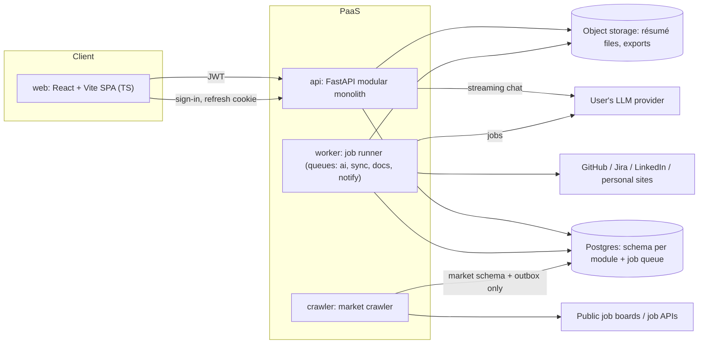
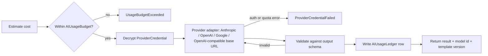

# Technical Boundaries: Job Searching Advisor

This doc turns the domain model in [`domain_model_review.md`](domain_model_review.md) into technical boundaries. It covers what gets deployed separately, who owns which data, where secrets can be decrypted, where untrusted input enters, and how modules talk to each other.

**Constraints:** modular monolith plus workers · Python backend, TypeScript client · managed PaaS · solo or small-team MVP · local embedding model for clustering · own email-and-password sign-in ([ADR 0001](decisions/0001-run-our-own-email-password-sign-in.md)).

## 1. Deployable units



| Unit | Responsibility | Can decrypt secrets? | Egress |
|---|---|---|---|
| `web` | SPA for the prototype's screens; no business rules, no AI calls | No | API, auth provider |
| `api` | HTTP + SSE, routers for every module, résumé chat streaming | **AI key only** (for chat streaming) | User's LLM provider |
| `worker` | Queued and scheduled jobs: `ai` (assessment, per-user role map over the user's top k, fit, gap plans per Target, difficulty estimates), `sync` (connectors, résumé parsing — **no AI**, domain decision 18), `docs` (PDF export), `notify` (weekly digest, interview prompts) | AI key (`ai` queue), connector OAuth tokens (`sync` queue) | LLM provider, GitHub/Jira/LinkedIn, personal sites, email |
| `crawler` | Weekly crawl of baseline and demand sources, and rate-limited single-company refresh: parse, normalize, dedup, embed and expire postings | **None** | Public job boards, job APIs, and subscription URLs (SSRF-guarded) |

**Why the crawler is its own unit:**
- It has a different trust level: it parses hostile HTML from the internet.
- It runs on a different schedule (weekly).
- It holds no secrets and never reads user data.

The four worker queues share one image for the MVP. Split them later by giving each queue its own process group, e.g. when Playwright's memory use starts crowding out AI jobs.

### Stack
| Layer | Choice | Why |
|---|---|---|
| API | Python 3.12, FastAPI, Pydantic v2 | Pydantic models are used for both API contracts and LLM output validation |
| Persistence | Postgres, SQLAlchemy 2, Alembic | One managed database for data, queue and outbox |
| Jobs | Procrastinate (Postgres-backed, periodic tasks) | No Redis at MVP scale |
| Documents | Playwright (PDF export), pypdf / python-docx (parsing) | |
| Local ML | sentence-transformers + HDBSCAN | Works with every LLM provider, including Anthropic, which has no embeddings API |
| Client | React + Vite, `openapi-typescript` client generated from FastAPI's OpenAPI | The API contract is the client/server boundary, checked in CI |
| Auth | Own sign-in in `identity`: Argon2id, 15-minute HS256 access tokens, rotating refresh cookie | No external account needed to run the app; see [ADR 0001](decisions/0001-run-our-own-email-password-sign-in.md) |

## 2. Code boundaries inside the monolith

```
backend/
  app/                      # composition root: FastAPI app, worker + crawler entrypoints, wiring
  kernel/                   # shared technical kernel, no domain logic
    db/ outbox/ jobs/ auth/ crypto/ storage/ ai_gateway/ fetch/ embeddings/
  domain/                   # the domain model: entities and rules; pure Python, no I/O
    identity/  profile/  market/  rolemap/  assessment/  gapplan/  resume/
  modules/
    identity/  profile/  market/  rolemap/  assessment/  gapplan/  resume/
      public.py             # the ONLY importable surface: service interface, DTOs, event types
      api.py                # FastAPI routers
      infra/                # repositories, external adapters
      jobs.py               # queued task handlers
  crawler/                  # separate deployable; uses kernel.db/fetch/embeddings + modules.market.public
web/                        # TS client
```

> The shared package is named `kernel`, not `platform`, because `platform` would shadow Python's standard-library module.
>
> The domain model is one top-level `domain/` folder with a package per feature, not a `domain/` inside each module. That is the design guideline's rule (its ADR 0002): the layer boundary is visible, and can be checked, against one path. The cost it names applies here too: one feature now spans `domain/<m>/` and `modules/<m>/`. Before 2026-09-22 each module had its own `domain/`, so ADRs 0002 and 0003 still cite `modules/rolemap/domain/selection.py`, which is now `domain/rolemap/selection.py`.
>
> `gapplan` and `resume` are Phase 2/3 and not built yet. `gapplan` replaces the earlier `growth`: with no CareerGoal (domain decision 16), the module is about plans for a Target and nothing else.

### Rules (enforced in CI with `import-linter` contracts)
1. A module imports another module **only** through its `public.py`.
2. `domain/` imports no application code (`app`, `modules`, `crawler`), nothing from `kernel/`, and no framework, ORM or HTTP library.
3. `crawler/` may import only `kernel.db`, `kernel.fetch`, `kernel.embeddings`, `kernel.outbox` and `modules.market.public`.
4. Only `kernel.ai_gateway` and `modules.profile.infra.connectors` may import `kernel.crypto`'s decrypt functions.
5. `modules.*` never call an LLM SDK directly; they go through `kernel.ai_gateway`.
6. `modules.profile` never imports `kernel.ai_gateway`, directly or indirectly. Ingestion is deterministic (domain decision 18), so a sync can never spend the user's key and the most hostile input never reaches a prompt from there.
7. Domain feature packages (`domain.identity`, `domain.market`, …) are independent: none imports another. A concept two features need gets its own feature package.
8. `modules.<m>` imports only `domain.<m>`. Another module's rules are reached through that module's `public.py` (rule 1).

### Communication
- **Queries** are synchronous in-process calls through `public.py`. For example, `resume` asks `assessment` for the current RoleFit.
- **Side effects** go through **domain events** with a **transactional outbox**. The event row is written in the same transaction as the change, and a dispatcher in `worker` turns events into queued jobs:

| Event | Emitted by | Handled by |
|---|---|---|
| `ProfileUpdated` | profile | assessment.run |
| `AssessmentCompleted` / `DimensionsChanged` | assessment | assessment.compute_fits |
| `PostingsChanged(markets, companies)` | crawler (via market) | dispatcher resolves affected users → rolemap.recluster per user. A baseline-only change reaches every user whose scope includes that market. |
| `RoleCountChanged(k)` | rolemap | rolemap.recluster for that user, after the cost estimate is confirmed |
| `SubscriptionAdded(company, url)` | market | worker materialises a `market.crawl_source` from the URL with no user id → single-company crawl |
| `RoleRequirementsChanged`, `RoleSplitOrMerged` | rolemap | assessment.compute_fits, gapplan.suggest_successor (for Targets whose snapshot came from that Role) |
| `InterviewReported` | profile | market.record_contribution, profile.add_evidence, assessment.calibrate_fit |
| `ProviderCredentialFailed`, `UsageBudgetExceeded` | kernel.ai_gateway | identity.pause_background_jobs, notify |

- **No module writes to another module's tables.**
- The crawler never works out which users are affected, because that would require reading user data. It emits events about markets and companies, and the worker fans them out to users.

### Context → module → schema

| Bounded context (domain doc §3) | Module | Schema(s) |
|---|---|---|
| Identity | `identity` | `identity` |
| Profile | `profile` | `profile` |
| Market (shared data) | `market` | `market` (shared) and `market_user` (owner zone; see §3) |
| Role map (per user) | `rolemap` | `rolemap` |
| Assessment | `assessment` | `assessment` |
| Gap plan | `gapplan` | `gapplan` |
| Resume | `resume` | `resume` |

## 3. Data boundaries

**One Postgres database:** a schema per module (above), plus `outbox` and `procrastinate`.

### Database roles (least privilege)
| Role | Used by | Access |
|---|---|---|
| `app_rw` | api, worker | All module schemas. `market`: read-only, except inserts into `market.interview_contribution` and writes to `market.crawl_source` (materialized from subscriptions) |
| `crawler_rw` | crawler | `market.crawl_source` (read/update status; baseline rows are loaded by `migrate`, not the crawler), `market.job_posting`, `market.company`, `market.posting_embedding`; insert into `outbox`. **No access to any user schema.** |
| `aggregator` | worker, aggregation job only | Read `market.interview_contribution`, write `market.interview_difficulty_agg` |
| `migrator` | Alembic in CI/CD | DDL |

### Shared zone vs. owner zone: privacy by storage location, not by a flag
- **Shared zone** (no `owner_id`, no RLS): `market.company`, `market.job_posting`, `market.crawl_source`, `market.posting_embedding`, `market.interview_contribution`, `market.interview_difficulty_agg`.
- **Owner zone:** every table has `owner_id` and **Postgres row-level security** keyed on a per-transaction `app.user_id` setting. The API sets it from the JWT; a worker sets it from the job's user. Covers `identity.provider_credential`, `identity.ai_usage_*`, and all of `profile.*`, `market_user.*`, `rolemap.*`, `assessment.*`, `gapplan.*` and `resume.*`.

| Domain data | Stored in | Why |
|---|---|---|
| RoleSubscription, MarketPreference | `market_user.company_subscription`, `market_user.market_preference` | User-owned. The subscription table keeps its name and gains `role_title`, a nullable `role_id` and a nullable `url` (domain decision 19); renaming it would mean rewriting the fan-out RLS policy for no gain. The worker copies the needed companies, URLs and markets into `market.crawl_source` **without user ids**, so the crawler can't tell who asked for them. |
| Baseline sources (domain decision 15) | `market.crawl_source` with `origin = 'baseline'` | A versioned seed owned by `modules.market`, loaded by `make migrate`. It is data reviewed like code, not environment configuration. Demand rows have `origin = 'demand'`. Neither carries a user id. |
| Role count k (domain decision 17) | `rolemap.role_map_setting` | Owner zone, one row per user; the bound is enforced in the `rolemap` domain rule and the API schema (ADR 0003). |
| GapPlan, Milestone, Task | `gapplan.*` | Owner zone. A plan row holds the Target as `target_kind` plus one of `job_posting_id`, `subscription_id` or `private_posting_id`, and the frozen requirements snapshot, so a plan survives posting expiry and re-clustering. |
| Pasted JDs (decision 12) | `market_user.private_job_posting` | The crawler role and shared queries physically can't reach them. An optional `shared_posting_id` gives a one-way link to a matching crawled posting. |
| InterviewReport, private part (outcome, stage notes) | `profile.interview_outcome` | Owner only; becomes Evidence and calibrates fit |
| InterviewReport, shared part (company, title, stages, difficulty) | `market.interview_contribution` with salted `contributor_hash` | Allows one vote per user with no link back to the account |
| Aggregated difficulty | `market.interview_difficulty_agg` | Published only for **≥ 3 distinct contributors**; the API reads this table, never raw contributions |

### Object storage
- Private bucket with keys shaped like `users/{owner_id}/…`, accessed through short-lived signed URLs.
- Uploaded résumé files and exported PDFs are never publicly addressable.

## 4. Secrets and trust boundaries

### Secrets
| Secret | Stored | Decrypted by | Never available to |
|---|---|---|---|
| User's LLM API key (`ProviderCredential`) | `identity.provider_credential`, envelope-encrypted | `kernel.ai_gateway` in `api` and `worker` | `web`, `crawler`, logs |
| Connector OAuth tokens (GitHub, Jira, LinkedIn) | `profile.source_connection`, envelope-encrypted | `profile.infra.connectors` in `worker` (`sync` queue) | `web`, `api` handlers, `crawler`, logs |
| Master encryption key | PaaS secret on `api` and `worker` only | `kernel.crypto` | `crawler` |
| Auth provider signing keys | Auth provider (API fetches public JWKS) | n/a | Everything else |

- **Envelope encryption:** each record has its own data key (AES-GCM), wrapped by the master key. Moving to a cloud KMS (AWS/GCP) later only replaces the master-key wrapper; the schema doesn't change.
- **Write-only API:** credentials can be set, tested, replaced or deleted. Reads return only provider, model and the last 4 characters.
- **Minimal key lifetime:** decrypt only for the duration of a call, keep the key only in memory, and scrub it from logs, traces and error reports.

### Untrusted inputs
Crawled pages, uploaded PDF/DOCX files, pasted JDs, repository and ticket content, personal sites, **and all LLM output** are treated as untrusted.

- **Parsing:** parse in `worker` or `crawler` only, never in `api` request handlers. Enforce size, page-count and time limits. The SPA never renders external HTML unsanitized.
- **Prompt-injection containment:**
  - External text goes into prompts as clearly delimited *data*, never as instructions.
  - The LLM gets **no tools with side effects**. Its only effect is structured output.
  - Every output is validated against a Pydantic schema; invalid output is retried or rejected.
  - Evidence ids cited by the AI must exist in *this user's* profile, or the output is rejected. This also blocks invented résumé claims.
- **SSRF protection** (`kernel.fetch`):
  - Block private, loopback, link-local and cloud-metadata addresses, and re-check after every redirect and DNS resolution.
  - Applies to personal-site crawling, to **subscription URLs** (fetched only by the crawler, from a `crawl_source` row with no owner), and to the **user-supplied LLM base URL**. A "Local" model therefore means an endpoint at a public URL the user controls, not one on the server's network.
- **Auth:** the API verifies JWT signature, issuer, audience and expiry on every request. Login OAuth (Google, via the auth provider) and connector OAuth (handled by `profile`) are separate flows with separate token storage.

## 5. AI gateway (`kernel/ai_gateway`)
The gateway is the only path to an LLM, used by `api` (streaming chat) and `worker` (jobs).

```python
run(user_id, task, template, inputs, output_schema) -> Result   # validated object + model id + template version
stream(user_id, task, template, inputs) -> AsyncIterator[Chunk]  # final chunk carries validated result
```



- **Prompt templates** are versioned files. Each snapshot (SkillAssessment, RoleFit, GapPlan, ResumeVersion) stores the model id and template version.
- **First-run cost confirmation** comes from the same estimate step, run in dry-run mode. The role-map estimate is capped at the user's k, and raising k asks for confirmation again (ADR 0003).
- **Callers:** `assessment` (analysis, follow-up questions, fit), `rolemap` (naming, requirements, difficulty), and later `gapplan` and `resume`. Never `profile`: ingestion is outside the gateway (rule 6).
- **Local ML is outside the gateway.** sentence-transformers and HDBSCAN run in `crawler` (posting embeddings, dedup) and in `worker` (per-user clustering over the embeddings of that user's market postings). The gateway on the user's key only **names clusters and extracts requirements**. Rule: *generative AI is paid by the user; plain computation is paid by the platform* (domain decision 7).

## 6. Schedules and flows across units

| Trigger | Unit | Flow |
|---|---|---|
| Weekly cron | crawler | crawl every `crawl_source`, baseline and demand → normalize → dedup → embed → expire unseen → outbox `PostingsChanged` |
| `PostingsChanged` | worker (`ai`) | resolve affected users → recluster → keep the user's top k clusters → name them and extract requirements → compute fits |
| User changes k | api → worker (`ai`) | cost estimate for k → user confirms → recluster → fits; lowering k retires roles without spending |
| User subscribes to a role (with URL) | api → worker → crawler | store in `market_user` → materialise `crawl_source` without user id → single-company crawl; no board found → `manual` coverage |
| Weekly cron, after crawl | worker (`notify`) | send `MatchDigest`; send interview-report prompts about 2 weeks after tailoring |
| Weekly cron | worker | re-check `manual` subscriptions for a supported board; refresh `crawl_source` from `market_user` |
| User subscribes / clicks refresh | api → crawler | single-company crawl, rate-limited per user per day |
| User clicks "Analyze" | api → worker (`ai`) | cost estimate → user confirms → assessment → follow-up questions or fits; SPA tracks job status over SSE |
| Connector authorized / weekly | worker (`sync`) | fetch → Evidence → `ProfileUpdated` |
| Résumé uploaded | api → worker (`sync`) | store file → parse → Evidence and base résumé |
| User picks a Target and generates a plan | api → worker (`ai`) | snapshot the Target's requirements → gaps → draft GapPlan → new version in plan history |
| User reopens a plan | api | read the GapPlan version; no AI |
| User picks a résumé Target | api → worker (`ai`) | RequirementCoverage from RoleFit → first ResumeVersion, every bullet citing Evidence |
| Résumé chat | api | `ai_gateway.stream` over SSE; each accepted edit saves a ResumeVersion |
| Export PDF | api → worker (`docs`) | Playwright render (white background, template) → object storage → signed URL |

## 7. Decisions

| # | Decision |
|---|---|
| T1 | Modular monolith (`api` + `worker`) plus a separate `crawler`; Python backend, TypeScript SPA; managed PaaS; small-team MVP |
| T2 | Modules interact only through `public.py`, enforced by `import-linter`; side effects via transactional outbox and events |
| T3 | One Postgres with a schema per module; separate least-privilege DB roles for crawler and aggregator; RLS on every owner-zone table |
| T4 | Privacy by storage location: subscriptions and pasted JDs in `market_user`; interview reports split into a private outcome and an anonymized contribution, aggregated at ≥ 3 contributors |
| T5 | Envelope encryption for the LLM key and connector tokens; master key only on `api` and `worker`; path to cloud KMS later |
| T6 | A single AI gateway: budget check → decrypt → provider adapter → schema validation → usage ledger |
| T7 | Local embeddings plus HDBSCAN for dedup and clustering; the LLM only names clusters and extracts requirements |
| T8 | ~~Managed auth provider~~ — **superseded by [ADR 0001](decisions/0001-run-our-own-email-password-sign-in.md)**: own email-and-password sign-in. Still true: FastAPI verifies JWTs on every request, and login is kept separate from connector OAuth |
| T9 | Untrusted-input rules: parsing only in workers, delimited prompts, no side-effecting tools, schema-validated output, SSRF-guarded fetch including custom LLM base URLs and subscription URLs |
| T10 | Baseline crawl: a platform-curated seed in `market.crawl_source` (`origin = 'baseline'`), loaded by `migrate`, shared zone, no user linkage |
| T11 | The role map's k is a per-user setting in `rolemap`, bounded, with the cost estimate capped at k ([ADR 0003](decisions/0003-let-the-user-choose-how-many-roles-to-analyse.md), superseding [ADR 0002](decisions/0002-analyse-only-the-ten-closest-roles.md)) |
| T12 | Ingestion never reaches the AI gateway: `profile` may not import `kernel.ai_gateway`, enforced by `import-linter` |
| T13 | Gap plans are keyed by Target (kind plus reference plus frozen requirements snapshot) in the `gapplan` module; the earlier `growth` module is not built |

### Coverage of domain decisions

| Domain decision | Technical boundary |
|---|---|
| 1 Per-user dimensions | `assessment` schema, owner zone; fit computed in worker `ai` |
| 2 / 7 Roles grouped by AI, user pays | T6, T7: per-user `rolemap`, clustering compute on the platform, naming on the user's key |
| 4 Multiple goals | *Superseded by 16* |
| 3 Key encrypted on server | T5, §4 secrets table |
| 5 / 11 Interview difficulty, reporter incentive | T4: split storage, ≥ 3 aggregation, outcome → Evidence → `calibrate_fit` |
| 6 Crawler, permitted sources only | T1, §1: separate `crawler`, no secrets, SSRF-guarded `kernel.fetch` |
| 8 5–10 dimensions | Enforced in the `assessment` domain rules and output schema |
| 9 User selects markets | `market_user.market_preference` → `market.crawl_source` without user ids |
| 10 / 20 App suggests successor role | `RoleSplitOrMerged` → `gapplan.suggest_successor` for affected Targets |
| 12 Private pasted JDs | T4: `market_user.private_job_posting` |
| 13 Manual fallback for uncrawlable companies | Weekly re-check job; `coverage` column in `market_user` |
| 14 Weekly crawl | §6 weekly cron chain; `MatchDigest` |
| 15 Baseline crawl | T10 |
| 16 GapPlan per Target | T13: `gapplan` schema |
| 17 User-chosen k | T11: `rolemap.role_map_setting`, `RoleCountChanged` |
| 18 Ingestion AI-free | T12: rule 6 |
| 19 Role subscriptions with URL | `market_user.company_subscription` gains role and URL columns; SSRF-guarded crawl of the URL |

## 8. Open questions

| # | Question | Status |
|---|---|---|
| 1 | **PaaS choice** (Fly.io / Render / Railway) | **Still open.** Phase 1 runs on local Docker Compose, so the decision is deferred. It affects per-service secrets — the master key must be settable on `api` and `worker` only — and whether one Playwright-capable worker image fits the memory limit. |
| 2 | **Auth provider** | **Answered: our own email and password, in `identity`** — see [ADR 0001](decisions/0001-run-our-own-email-password-sign-in.md), which supersedes the earlier choice of Clerk (it needs an external account). Argon2id hashes, time-based lockout after 5 failures, 15-minute access tokens held in memory, and rotating 30-day refresh tokens in an httpOnly `SameSite=Strict` cookie, stored hashed. A reused refresh token revokes its whole chain. `kernel/auth` verifies through a `SigningKeyResolver`, so moving to a hosted OpenID provider later is a wiring change, not a rewrite. **Not yet built, both blocked on Q3:** address verification and password reset. |
| 3 | **Email delivery** for digests and prompts | **Still open — and now on the critical path.** Beyond `MatchDigest` and interview-report prompts (Phase 2), owning sign-in means address verification and password reset both need it. Until then, anyone can register an address they do not own, and a forgotten password cannot be recovered. |

### Decided during Phase 1 implementation

| Decision | Why |
|---|---|
| Alembic's bookkeeping and Procrastinate's tables each get their own schema | `public` has its default grants revoked, so nothing may create objects there. |
| `make migrate` applies the job schema too, idempotently | The worker's tables must exist before `start-app` brings a worker up — never created lazily by the first worker to connect. |
| A posting deduped across sources is owned by the source that saw it last | Expiry is scoped per source, so otherwise a deduped posting would have no crawl responsible for expiring it. |
| The single-company refresh job takes a crawler-role connection | `app_rw` is read-only on the shared market zone; only the crawler writes postings. |
| Everything runs in a container, driven by `make` over `docker`; a contributor installs only Docker and `make` | The guideline's containers-by-default rule. It also removes the class of bug where CI and a laptop run different tool versions. |
| `api`, `worker` and `crawler` are one image with three commands; `tools` is that image plus the dev group | "One artifact promoted unchanged". The tools layer is additive, so the test and gate containers are the same interpreter and source layout the app runs with. |
| Each service gets only the configuration it needs — `env_file` is never on the shared compose anchor | Handing every container the whole `.env` would put the master key and the connector secrets inside the crawler and the SPA. The crawler now runs on 10 variables and no secrets, and `Settings.require_for(Unit)` asserts that per process at startup. |
| The SPA reads `window.__APP_CONFIG__`, written by its container entrypoint | Build-time `VITE_` inlining would mean a different bundle per environment, which defeats promoting one artifact. |
| A second `S3_PUBLIC_ENDPOINT_URL`, used only for presigning | A presigned URL is signed against its own host, so signing with the internal service name would hand the browser an address it cannot resolve. |
| `torch` pinned to the CPU-only wheel index | The default PyPI wheel bundles the NVIDIA CUDA runtime: the Linux image went from 9.8 GB to 2.1 GB for hardware we never use. |
| Infra and app are separate compose projects sharing an external network | With one project name, `stop-app --remove-orphans` deleted the Postgres container. An app target must not be able to touch infra. |
| The two authentication tables get the same bootstrap RLS exception as `identity.account` | Sign-in reads them before there is an `app.user_id` to compare against, by definition. Every other owner-zone table — including the budget created at registration — keeps the strict policy and is written in a scoped session. |
| Authentication state changes commit *before* a rejection is raised | Raising inside the transaction rolled back the failed-attempt counter and the refresh-family revocation, so lockout never engaged and a stolen token chain stayed alive. Found by the integration tests. |
| Request-validation errors use the same `{error: {code, message}}` envelope as everything else | FastAPI's default is a list of Pydantic objects, so the SPA could only say "Request failed (422)" instead of why. |
| One narrow `SELECT`-only RLS policy on `market_user.company_subscription` and `market_user.market_preference`, gated on an `app.fanout` transaction setting | The dispatcher must resolve a market change to affected users, and the crawler must not. The alternative — `BYPASSRLS` on `app_rw` — would have opened every table instead of two columns. |
