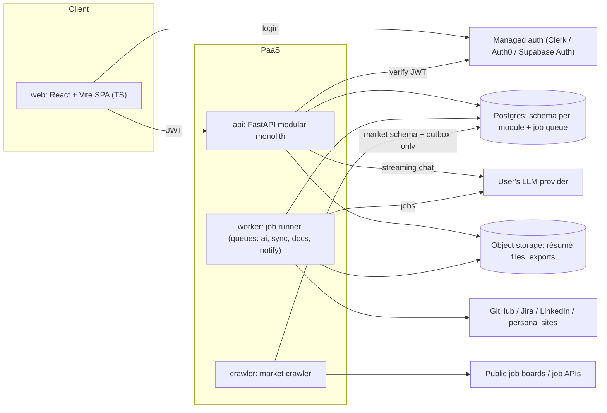
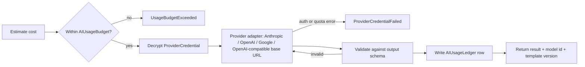

# Technical Boundaries: Job Searching Advisor

This doc turns the domain model in [`domain_model_review.md`](domain_model_review.md) into technical boundaries. It covers what gets deployed separately, who owns which data, where secrets can be decrypted, where untrusted input enters, and how modules talk to each other.

**Constraints:** modular monolith plus workers · Python backend, TypeScript client · managed PaaS · solo or small-team MVP · local embedding model for clustering · managed auth provider.

## 1. Deployable units



| Unit | Responsibility | Can decrypt secrets? | Egress |
|---|---|---|---|
| `web` | SPA for the prototype's screens; no business rules, no AI calls | No | API, auth provider |
| `api` | HTTP + SSE, routers for every module, résumé chat streaming | **AI key only** (for chat streaming) | User's LLM provider |
| `worker` | Queued and scheduled jobs: `ai` (assessment, cluster naming, fit, plans, difficulty estimates), `sync` (connectors, résumé parsing), `docs` (PDF export), `notify` (weekly digest, interview prompts) | AI key (`ai` queue), connector OAuth tokens (`sync` queue) | LLM provider, GitHub/Jira/LinkedIn, personal sites, email |
| `crawler` | Weekly crawl and rate-limited single-company refresh: parse, normalize, dedup, embed and expire postings | **None** | Public job boards and job APIs only |

**Why the crawler is its own unit:**
- It has a different trust level: it parses hostile HTML from the internet.
- It runs on a different schedule (weekly).
- It holds no secrets and never reads user data.

The four worker queues share one image for the MVP. Split them later by giving each queue its own process group, e.g. when Playwright's memory use starts crowding out AI jobs.

### Stack
| Layer | Choice | Why |
|---|---|---|
| API | Python 3.12, FastAPI, Pydantic v2 | Pydantic models are used for both API contracts and LLM output validation |
| Persistence | Postgres, SQLAlchemy 2, Alembic | One managed database for data, queue and outbox |
| Jobs | Procrastinate (Postgres-backed, periodic tasks) | No Redis at MVP scale |
| Documents | Playwright (PDF export), pypdf / python-docx (parsing) | |
| Local ML | sentence-transformers + HDBSCAN | Works with every LLM provider, including Anthropic, which has no embeddings API |
| Client | React + Vite, `openapi-typescript` client generated from FastAPI's OpenAPI | The API contract is the client/server boundary, checked in CI |
| Auth | Managed provider issuing JWTs | Less security surface for a small team |

## 2. Code boundaries inside the monolith

```
backend/
  app/                      # composition root: FastAPI app, worker + crawler entrypoints, wiring
  kernel/                   # shared technical kernel, no domain logic
    db/ outbox/ jobs/ auth/ crypto/ storage/ ai_gateway/ fetch/ embeddings/
  modules/
    identity/  profile/  market/  rolemap/  assessment/  growth/  resume/
      public.py             # the ONLY importable surface: service interface, DTOs, event types
      api.py                # FastAPI routers
      domain/               # entities and rules; pure Python, no I/O
      infra/                # repositories, external adapters
      jobs.py               # queued task handlers
  crawler/                  # separate deployable; uses kernel.db/fetch/embeddings + modules.market.public
web/                        # TS client
```

> The shared package is named `kernel`, not `platform`, because `platform` would shadow Python's standard-library module.

### Rules (enforced in CI with `import-linter` contracts)
1. A module imports another module **only** through its `public.py`.
2. `domain/` imports nothing from `infra/`, `kernel/` or FastAPI.
3. `crawler/` may import only `kernel.db`, `kernel.fetch`, `kernel.embeddings`, `kernel.outbox` and `modules.market.public`.
4. Only `kernel.ai_gateway` and `modules.profile.infra.connectors` may import `kernel.crypto`'s decrypt functions.
5. `modules.*` never call an LLM SDK directly; they go through `kernel.ai_gateway`.

### Communication
- **Queries** are synchronous in-process calls through `public.py`. For example, `resume` asks `assessment` for the current RoleFit.
- **Side effects** go through **domain events** with a **transactional outbox**. The event row is written in the same transaction as the change, and a dispatcher in `worker` turns events into queued jobs:

| Event | Emitted by | Handled by |
|---|---|---|
| `ProfileUpdated` | profile | assessment.run |
| `AssessmentCompleted` / `DimensionsChanged` | assessment | assessment.compute_fits |
| `PostingsChanged(markets, companies)` | crawler (via market) | dispatcher resolves affected users → rolemap.recluster per user |
| `RoleRequirementsChanged`, `RoleSplitOrMerged` | rolemap | assessment.compute_fits, growth.suggest_successor |
| `InterviewReported` | profile | market.record_contribution, profile.add_evidence, assessment.calibrate_fit |
| `ProviderCredentialFailed`, `UsageBudgetExceeded` | kernel.ai_gateway | identity.pause_background_jobs, notify |

- **No module writes to another module's tables.**
- The crawler never works out which users are affected, because that would require reading user data. It emits events about markets and companies, and the worker fans them out to users.

### Context → module → schema

| Bounded context (domain doc §3) | Module | Schema(s) |
|---|---|---|
| Identity | `identity` | `identity` |
| Profile | `profile` | `profile` |
| Market (shared data) | `market` | `market` (shared) and `market_user` (owner zone; see §3) |
| Role map (per user) | `rolemap` | `rolemap` |
| Assessment | `assessment` | `assessment` |
| Growth | `growth` | `growth` |
| Resume | `resume` | `resume` |

## 3. Data boundaries

**One Postgres database:** a schema per module (above), plus `outbox` and `procrastinate`.

### Database roles (least privilege)
| Role | Used by | Access |
|---|---|---|
| `app_rw` | api, worker | All module schemas. `market`: read-only, except inserts into `market.interview_contribution` and writes to `market.crawl_source` (materialized from subscriptions) |
| `crawler_rw` | crawler | `market.crawl_source` (read/update status), `market.job_posting`, `market.company`, `market.posting_embedding`; insert into `outbox`. **No access to any user schema.** |
| `aggregator` | worker, aggregation job only | Read `market.interview_contribution`, write `market.interview_difficulty_agg` |
| `migrator` | Alembic in CI/CD | DDL |

### Shared zone vs. owner zone: privacy by storage location, not by a flag
- **Shared zone** (no `owner_id`, no RLS): `market.company`, `market.job_posting`, `market.crawl_source`, `market.posting_embedding`, `market.interview_contribution`, `market.interview_difficulty_agg`.
- **Owner zone:** every table has `owner_id` and **Postgres row-level security** keyed on a per-transaction `app.user_id` setting. The API sets it from the JWT; a worker sets it from the job's user. Covers `identity.provider_credential`, `identity.ai_usage_*`, and all of `profile.*`, `market_user.*`, `rolemap.*`, `assessment.*`, `growth.*` and `resume.*`.

| Domain data | Stored in | Why |
|---|---|---|
| CompanySubscription, MarketPreference | `market_user` | User-owned. The worker copies the needed companies and markets into `market.crawl_source` **without user ids**, so the crawler can't tell who asked for them. |
| Pasted JDs (decision 12) | `market_user.private_job_posting` | The crawler role and shared queries physically can't reach them. An optional `shared_posting_id` gives a one-way link to a matching crawled posting. |
| InterviewReport, private part (outcome, stage notes) | `profile.interview_outcome` | Owner only; becomes Evidence and calibrates fit |
| InterviewReport, shared part (company, title, stages, difficulty) | `market.interview_contribution` with salted `contributor_hash` | Allows one vote per user with no link back to the account |
| Aggregated difficulty | `market.interview_difficulty_agg` | Published only for **≥ 3 distinct contributors**; the API reads this table, never raw contributions |

### Object storage
- Private bucket with keys shaped like `users/{owner_id}/…`, accessed through short-lived signed URLs.
- Uploaded résumé files and exported PDFs are never publicly addressable.

## 4. Secrets and trust boundaries

### Secrets
| Secret | Stored | Decrypted by | Never available to |
|---|---|---|---|
| User's LLM API key (`ProviderCredential`) | `identity.provider_credential`, envelope-encrypted | `kernel.ai_gateway` in `api` and `worker` | `web`, `crawler`, logs |
| Connector OAuth tokens (GitHub, Jira, LinkedIn) | `profile.source_connection`, envelope-encrypted | `profile.infra.connectors` in `worker` (`sync` queue) | `web`, `api` handlers, `crawler`, logs |
| Master encryption key | PaaS secret on `api` and `worker` only | `kernel.crypto` | `crawler` |
| Auth provider signing keys | Auth provider (API fetches public JWKS) | n/a | Everything else |

- **Envelope encryption:** each record has its own data key (AES-GCM), wrapped by the master key. Moving to a cloud KMS (AWS/GCP) later only replaces the master-key wrapper; the schema doesn't change.
- **Write-only API:** credentials can be set, tested, replaced or deleted. Reads return only provider, model and the last 4 characters.
- **Minimal key lifetime:** decrypt only for the duration of a call, keep the key only in memory, and scrub it from logs, traces and error reports.

### Untrusted inputs
Crawled pages, uploaded PDF/DOCX files, pasted JDs, repository and ticket content, personal sites, **and all LLM output** are treated as untrusted.

- **Parsing:** parse in `worker` or `crawler` only, never in `api` request handlers. Enforce size, page-count and time limits. The SPA never renders external HTML unsanitized.
- **Prompt-injection containment:**
  - External text goes into prompts as clearly delimited *data*, never as instructions.
  - The LLM gets **no tools with side effects**. Its only effect is structured output.
  - Every output is validated against a Pydantic schema; invalid output is retried or rejected.
  - Evidence ids cited by the AI must exist in *this user's* profile, or the output is rejected. This also blocks invented résumé claims.
- **SSRF protection** (`kernel.fetch`):
  - Block private, loopback, link-local and cloud-metadata addresses, and re-check after every redirect and DNS resolution.
  - Applies to personal-site crawling and to the **user-supplied LLM base URL**. A "Local" model therefore means an endpoint at a public URL the user controls, not one on the server's network.
- **Auth:** the API verifies JWT signature, issuer, audience and expiry on every request. Login OAuth (Google, via the auth provider) and connector OAuth (handled by `profile`) are separate flows with separate token storage.

## 5. AI gateway (`kernel/ai_gateway`)
The gateway is the only path to an LLM, used by `api` (streaming chat) and `worker` (jobs).

```python
run(user_id, task, template, inputs, output_schema) -> Result   # validated object + model id + template version
stream(user_id, task, template, inputs) -> AsyncIterator[Chunk]  # final chunk carries validated result
```



- **Prompt templates** are versioned files. Each snapshot (SkillAssessment, RoleFit, GapPlan, ResumeVersion) stores the model id and template version.
- **First-run cost confirmation** comes from the same estimate step, run in dry-run mode.
- **Local ML is outside the gateway.** sentence-transformers and HDBSCAN run in `crawler` (posting embeddings, dedup) and in `worker` (per-user clustering over the embeddings of that user's market postings). The gateway on the user's key only **names clusters and extracts requirements**. Rule: *generative AI is paid by the user; plain computation is paid by the platform* (domain decision 7).

## 6. Schedules and flows across units

| Trigger | Unit | Flow |
|---|---|---|
| Weekly cron | crawler | crawl `crawl_source` → normalize → dedup → embed → expire unseen → outbox `PostingsChanged` |
| `PostingsChanged` | worker (`ai`) | resolve affected users → recluster → name clusters and extract requirements → compute fits |
| Weekly cron, after crawl | worker (`notify`) | send `MatchDigest`; send interview-report prompts about 2 weeks after tailoring |
| Weekly cron | worker | re-check `manual` subscriptions for a supported board; refresh `crawl_source` from `market_user` |
| User subscribes / clicks refresh | api → crawler | single-company crawl, rate-limited per user per day |
| User clicks "Analyze" | api → worker (`ai`) | cost estimate → user confirms → assessment → follow-up questions or fits; SPA tracks job status over SSE |
| Connector authorized / weekly | worker (`sync`) | fetch → Evidence → `ProfileUpdated` |
| Résumé uploaded | api → worker (`sync`) | store file → parse → Evidence and base résumé |
| Résumé chat | api | `ai_gateway.stream` over SSE; each accepted edit saves a ResumeVersion |
| Export PDF | api → worker (`docs`) | Playwright render (white background, template) → object storage → signed URL |

## 7. Decisions

| # | Decision |
|---|---|
| T1 | Modular monolith (`api` + `worker`) plus a separate `crawler`; Python backend, TypeScript SPA; managed PaaS; small-team MVP |
| T2 | Modules interact only through `public.py`, enforced by `import-linter`; side effects via transactional outbox and events |
| T3 | One Postgres with a schema per module; separate least-privilege DB roles for crawler and aggregator; RLS on every owner-zone table |
| T4 | Privacy by storage location: subscriptions and pasted JDs in `market_user`; interview reports split into a private outcome and an anonymized contribution, aggregated at ≥ 3 contributors |
| T5 | Envelope encryption for the LLM key and connector tokens; master key only on `api` and `worker`; path to cloud KMS later |
| T6 | A single AI gateway: budget check → decrypt → provider adapter → schema validation → usage ledger |
| T7 | Local embeddings plus HDBSCAN for dedup and clustering; the LLM only names clusters and extracts requirements |
| T8 | Managed auth provider; FastAPI verifies JWTs; login OAuth kept separate from connector OAuth |
| T9 | Untrusted-input rules: parsing only in workers, delimited prompts, no side-effecting tools, schema-validated output, SSRF-guarded fetch including custom LLM base URLs |

### Coverage of domain decisions

| Domain decision | Technical boundary |
|---|---|
| 1 Per-user dimensions | `assessment` schema, owner zone; fit computed in worker `ai` |
| 2 / 7 Roles grouped by AI, user pays | T6, T7: per-user `rolemap`, clustering compute on the platform, naming on the user's key |
| 3 Key encrypted on server | T5, §4 secrets table |
| 4 Multiple goals | `growth` schema; `growth.suggest_successor` handler |
| 5 / 11 Interview difficulty, reporter incentive | T4: split storage, ≥ 3 aggregation, outcome → Evidence → `calibrate_fit` |
| 6 Crawler, permitted sources only | T1, §1: separate `crawler`, no secrets, SSRF-guarded `kernel.fetch` |
| 8 5–10 dimensions | Enforced in the `assessment` domain rules and output schema |
| 9 User selects markets | `market_user.market_preference` → `market.crawl_source` without user ids |
| 10 App suggests successor role | `RoleSplitOrMerged` → `growth.suggest_successor` |
| 12 Private pasted JDs | T4: `market_user.private_job_posting` |
| 13 Manual fallback for uncrawlable companies | Weekly re-check job; `coverage` column in `market_user` |
| 14 Weekly crawl | §6 weekly cron chain; `MatchDigest` |

## 8. Open questions

| # | Question | Status |
|---|---|---|
| 1 | **PaaS choice** (Fly.io / Render / Railway) | **Still open.** Phase 1 runs on local Docker Compose, so the decision is deferred. It affects per-service secrets — the master key must be settable on `api` and `worker` only — and whether one Playwright-capable worker image fits the memory limit. |
| 2 | **Auth provider** | **Answered: Clerk.** The SPA uses its React SDK; FastAPI verifies the JWT against its JWKS (`kernel/auth`). Google login in Phase 2 is a provider-side toggle. Nothing vendor-shaped leaks past `kernel/auth`, so swapping issuers later is one module. |
| 3 | **Email delivery** for digests and prompts | **Still open, not needed yet.** `MatchDigest` and interview-report prompts are Phase 2; the `notify` queue does not exist in Phase 1. |

### Decided during Phase 1 implementation

| Decision | Why |
|---|---|
| Alembic's bookkeeping and Procrastinate's tables each get their own schema | `public` has its default grants revoked, so nothing may create objects there. |
| `make migrate` applies the job schema too, idempotently | The worker's tables must exist before `start-app` brings a worker up — never created lazily by the first worker to connect. |
| A posting deduped across sources is owned by the source that saw it last | Expiry is scoped per source, so otherwise a deduped posting would have no crawl responsible for expiring it. |
| The single-company refresh job takes a crawler-role connection | `app_rw` is read-only on the shared market zone; only the crawler writes postings. |
| One narrow `SELECT`-only RLS policy on `market_user.company_subscription` and `market_user.market_preference`, gated on an `app.fanout` transaction setting | The dispatcher must resolve a market change to affected users, and the crawler must not. The alternative — `BYPASSRLS` on `app_rw` — would have opened every table instead of two columns. |
